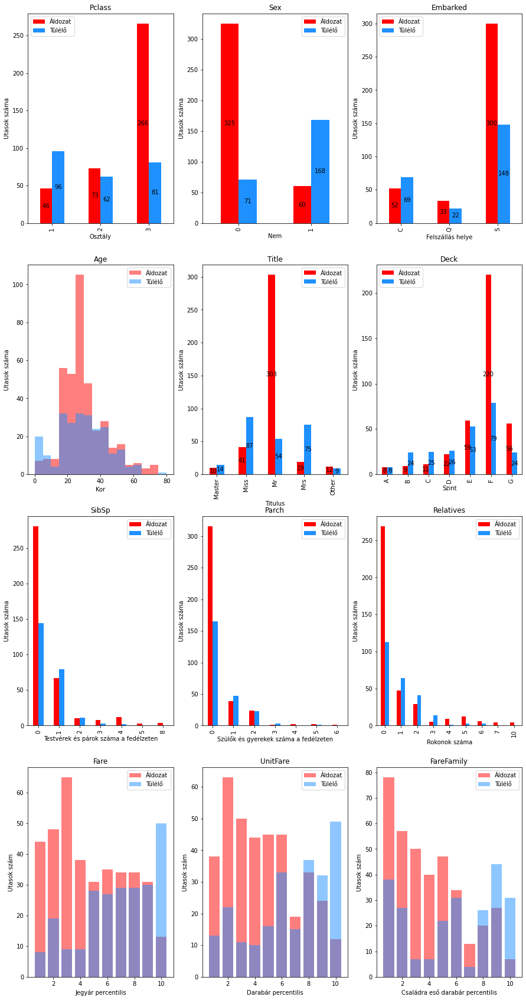
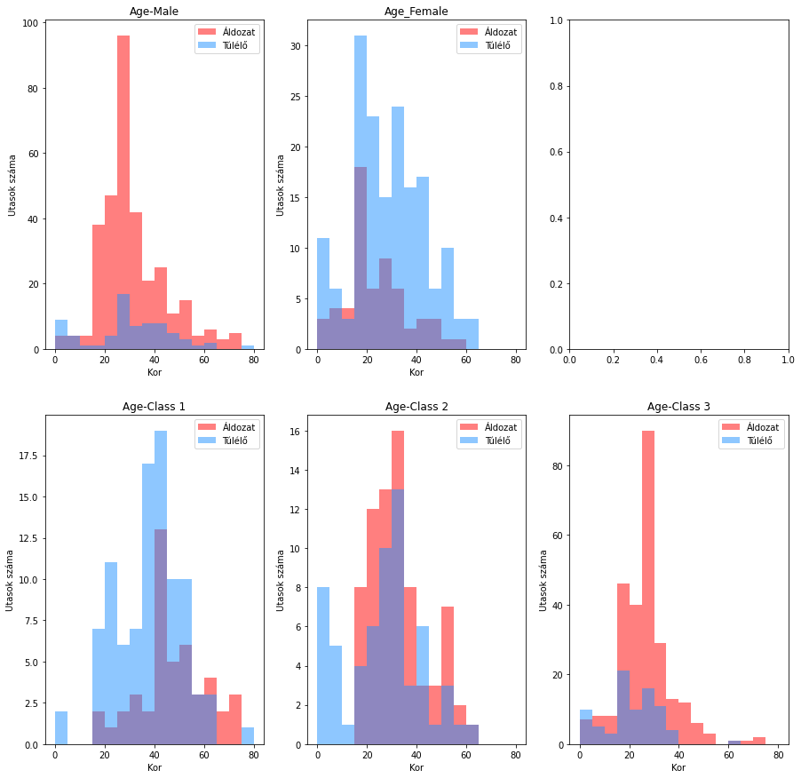
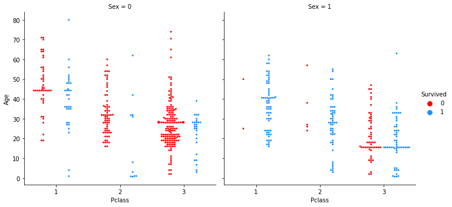
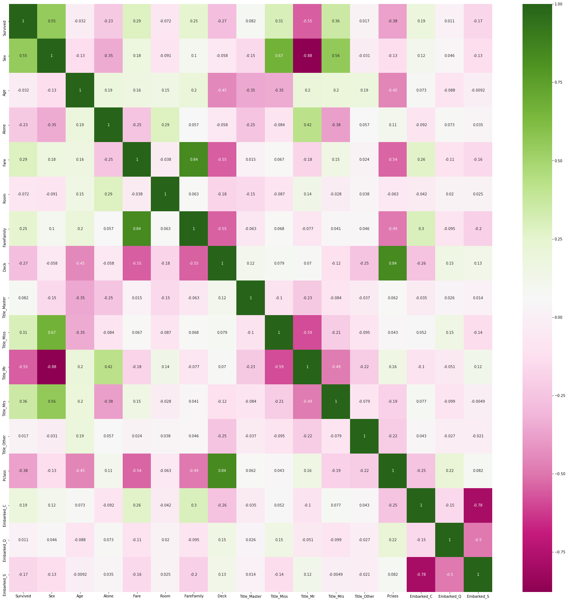
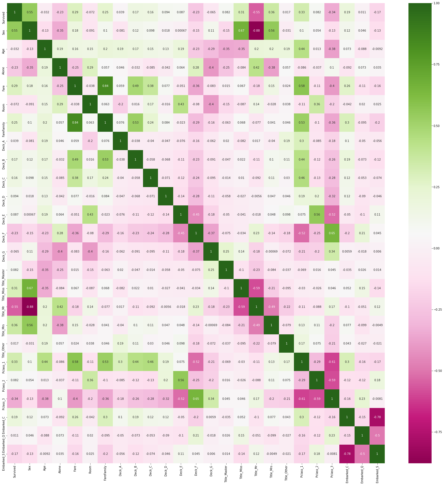
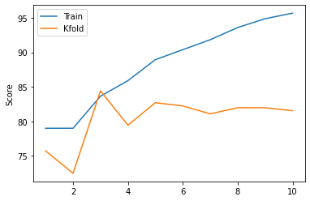
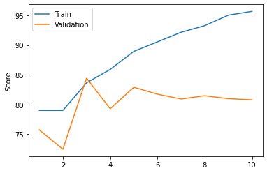
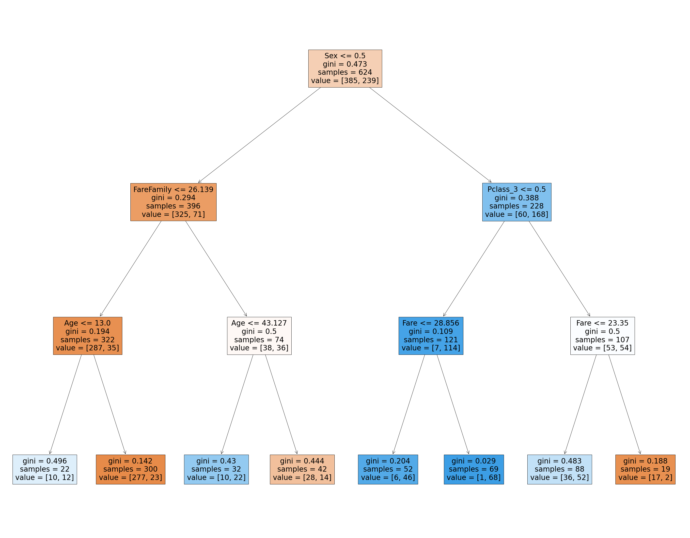

```python
import pandas as pd
import numpy as np
import matplotlib.pyplot as plt
import sklearn
import seaborn as sn
import random
```


```python
df_train_orig = pd.read_csv("data/DA_titanic_train.csv")
df_test_orig = pd.read_csv("data/DA_titanic_test.csv")
df_train = df_train_orig.copy(deep=True)
df_test = df_test_orig.copy(deep=True)
```

## Adatok megismerése


```python
df_train.info()
```

    <class 'pandas.core.frame.DataFrame'>
    RangeIndex: 624 entries, 0 to 623
    Data columns (total 12 columns):
     #   Column       Non-Null Count  Dtype  
    ---  ------       --------------  -----  
     0   PassengerId  624 non-null    int64  
     1   Survived     624 non-null    int64  
     2   Pclass       624 non-null    int64  
     3   Name         624 non-null    object 
     4   Sex          624 non-null    object 
     5   Age          494 non-null    float64
     6   SibSp        624 non-null    int64  
     7   Parch        624 non-null    int64  
     8   Ticket       624 non-null    object 
     9   Fare         624 non-null    float64
     10  Cabin        128 non-null    object 
     11  Embarked     623 non-null    object 
    dtypes: float64(2), int64(5), object(5)
    memory usage: 58.6+ KB
    


```python
df_train.describe()

```


<div>
<style scoped>
    .dataframe tbody tr th:only-of-type {
        vertical-align: middle;
    }

    .dataframe tbody tr th {
        vertical-align: top;
    }

    .dataframe thead th {
        text-align: right;
    }
</style>
<table border="1" class="dataframe">
  <thead>
    <tr style="text-align: right;">
      <th></th>
      <th>PassengerId</th>
      <th>Survived</th>
      <th>Pclass</th>
      <th>Age</th>
      <th>SibSp</th>
      <th>Parch</th>
      <th>Fare</th>
    </tr>
  </thead>
  <tbody>
    <tr>
      <th>count</th>
      <td>624.000000</td>
      <td>624.000000</td>
      <td>624.000000</td>
      <td>494.000000</td>
      <td>624.000000</td>
      <td>624.000000</td>
      <td>624.000000</td>
    </tr>
    <tr>
      <th>mean</th>
      <td>459.128205</td>
      <td>0.383013</td>
      <td>2.328526</td>
      <td>29.658745</td>
      <td>0.519231</td>
      <td>0.354167</td>
      <td>30.523470</td>
    </tr>
    <tr>
      <th>std</th>
      <td>257.314092</td>
      <td>0.486511</td>
      <td>0.822684</td>
      <td>14.770773</td>
      <td>1.071871</td>
      <td>0.775559</td>
      <td>48.186064</td>
    </tr>
    <tr>
      <th>min</th>
      <td>1.000000</td>
      <td>0.000000</td>
      <td>1.000000</td>
      <td>0.670000</td>
      <td>0.000000</td>
      <td>0.000000</td>
      <td>0.000000</td>
    </tr>
    <tr>
      <th>25%</th>
      <td>241.750000</td>
      <td>0.000000</td>
      <td>2.000000</td>
      <td>20.000000</td>
      <td>0.000000</td>
      <td>0.000000</td>
      <td>7.895800</td>
    </tr>
    <tr>
      <th>50%</th>
      <td>460.500000</td>
      <td>0.000000</td>
      <td>3.000000</td>
      <td>28.000000</td>
      <td>0.000000</td>
      <td>0.000000</td>
      <td>13.931250</td>
    </tr>
    <tr>
      <th>75%</th>
      <td>683.250000</td>
      <td>1.000000</td>
      <td>3.000000</td>
      <td>38.000000</td>
      <td>1.000000</td>
      <td>0.000000</td>
      <td>30.000000</td>
    </tr>
    <tr>
      <th>max</th>
      <td>891.000000</td>
      <td>1.000000</td>
      <td>3.000000</td>
      <td>80.000000</td>
      <td>8.000000</td>
      <td>6.000000</td>
      <td>512.329200</td>
    </tr>
  </tbody>
</table>
</div>


```python
df_train.head(10)
```


<div>
<style scoped>
    .dataframe tbody tr th:only-of-type {
        vertical-align: middle;
    }

    .dataframe tbody tr th {
        vertical-align: top;
    }

    .dataframe thead th {
        text-align: right;
    }
</style>
<table border="1" class="dataframe">
  <thead>
    <tr style="text-align: right;">
      <th></th>
      <th>PassengerId</th>
      <th>Survived</th>
      <th>Pclass</th>
      <th>Name</th>
      <th>Sex</th>
      <th>Age</th>
      <th>SibSp</th>
      <th>Parch</th>
      <th>Ticket</th>
      <th>Fare</th>
      <th>Cabin</th>
      <th>Embarked</th>
    </tr>
  </thead>
  <tbody>
    <tr>
      <th>0</th>
      <td>1</td>
      <td>0</td>
      <td>3</td>
      <td>Braund, Mr. Owen Harris</td>
      <td>male</td>
      <td>22.0</td>
      <td>1</td>
      <td>0</td>
      <td>A/5 21171</td>
      <td>7.2500</td>
      <td>NaN</td>
      <td>S</td>
    </tr>
    <tr>
      <th>1</th>
      <td>2</td>
      <td>1</td>
      <td>1</td>
      <td>Cumings, Mrs. John Bradley (Florence Briggs Th...</td>
      <td>female</td>
      <td>38.0</td>
      <td>1</td>
      <td>0</td>
      <td>PC 17599</td>
      <td>71.2833</td>
      <td>C85</td>
      <td>C</td>
    </tr>
    <tr>
      <th>2</th>
      <td>3</td>
      <td>1</td>
      <td>3</td>
      <td>Heikkinen, Miss. Laina</td>
      <td>female</td>
      <td>26.0</td>
      <td>0</td>
      <td>0</td>
      <td>STON/O2. 3101282</td>
      <td>7.9250</td>
      <td>NaN</td>
      <td>S</td>
    </tr>
    <tr>
      <th>3</th>
      <td>5</td>
      <td>0</td>
      <td>3</td>
      <td>Allen, Mr. William Henry</td>
      <td>male</td>
      <td>35.0</td>
      <td>0</td>
      <td>0</td>
      <td>373450</td>
      <td>8.0500</td>
      <td>NaN</td>
      <td>S</td>
    </tr>
    <tr>
      <th>4</th>
      <td>10</td>
      <td>1</td>
      <td>2</td>
      <td>Nasser, Mrs. Nicholas (Adele Achem)</td>
      <td>female</td>
      <td>14.0</td>
      <td>1</td>
      <td>0</td>
      <td>237736</td>
      <td>30.0708</td>
      <td>NaN</td>
      <td>C</td>
    </tr>
    <tr>
      <th>5</th>
      <td>11</td>
      <td>1</td>
      <td>3</td>
      <td>Sandstrom, Miss. Marguerite Rut</td>
      <td>female</td>
      <td>4.0</td>
      <td>1</td>
      <td>1</td>
      <td>PP 9549</td>
      <td>16.7000</td>
      <td>G6</td>
      <td>S</td>
    </tr>
    <tr>
      <th>6</th>
      <td>13</td>
      <td>0</td>
      <td>3</td>
      <td>Saundercock, Mr. William Henry</td>
      <td>male</td>
      <td>20.0</td>
      <td>0</td>
      <td>0</td>
      <td>A/5. 2151</td>
      <td>8.0500</td>
      <td>NaN</td>
      <td>S</td>
    </tr>
    <tr>
      <th>7</th>
      <td>14</td>
      <td>0</td>
      <td>3</td>
      <td>Andersson, Mr. Anders Johan</td>
      <td>male</td>
      <td>39.0</td>
      <td>1</td>
      <td>5</td>
      <td>347082</td>
      <td>31.2750</td>
      <td>NaN</td>
      <td>S</td>
    </tr>
    <tr>
      <th>8</th>
      <td>15</td>
      <td>0</td>
      <td>3</td>
      <td>Vestrom, Miss. Hulda Amanda Adolfina</td>
      <td>female</td>
      <td>14.0</td>
      <td>0</td>
      <td>0</td>
      <td>350406</td>
      <td>7.8542</td>
      <td>NaN</td>
      <td>S</td>
    </tr>
    <tr>
      <th>9</th>
      <td>16</td>
      <td>1</td>
      <td>2</td>
      <td>Hewlett, Mrs. (Mary D Kingcome)</td>
      <td>female</td>
      <td>55.0</td>
      <td>0</td>
      <td>0</td>
      <td>248706</td>
      <td>16.0000</td>
      <td>NaN</td>
      <td>S</td>
    </tr>
  </tbody>
</table>
</div>


A train adatokat első körben megvizsgálva látható, hogy 3 oszlop tartalmaz hiányos adatokat: az összesen 624 utas közül csak 494-nek ismerük a korát, 128-nak a cabin számát és 623-nak a felszállás helyét.

A PassengerId az utas egyedi azonosítója, egy integer. Mivel ez az adatbázisban elfoglalt helyét mutatja csak meg az utasnak, ezért várhatóan ezt nem fogom felhasználni.

A Survived alapján osztályozzuk az utasokat, értéke 0, amennyiben áldozat, 1 amennyiben túlélő. Összesen az utasok 38.3%-a élte túl a balesetet, tehát ez egy kiegyensúlyozatlan adathalmaz.

A Pclass fejezi ki, milyen osztályra szólt a jegye. Értéke 1,2,3 számok közül kerül ki, amely kifejezi, hogy melyik osztályon utazott. Kategórikus érték, ezért lehet érdemes külön oszlopokban one-hot vektorként tárolni.

A Name az utas neve. Elsőként a vezetéknév, vagy vezetéknevek szerepelnek, majd vessző után az utas titulusa, majd a keresztnevek, leánykori nevek, becenevek szerepelnek. A titulus információként szolgálhat az utas családi állapotáról, nemesi rangjáról, amely befolyásolhatta a túlélési esélyeit, ezt érdemes lehet külön attribútumként tárolni.

A Sex az utas neme, male abban az esetben ha férfi, female abban az esetben ha nő, ezt bináris értékké konvertálom.

Az Age az utas kora években mérve, értéke 0.67 (8 hónap) és 80 között van.

A SibSp az utas fedélzeten lévő testvéreinek és házastársainak a száma.

A Parch az utas fedélzeten lévő szüleinek és gyerekeinek a száma.

A Ticket az utas jegyének a számát jelenti. Nem találtam egységes szabályt a jelentésére, a szám valószínűleg egy azonosító, az előtte lévő karakterek pedig amennyiben vannak, a jegy vételét azonosíthatják, néhány esetben város névvel. Több utasnak is lehet ugyanaz a jegye, amely szintén az utasok közötti kapcsolatnak egy jele, amely befolyásolhatja a túlélési esélyüket. Ez azonban egy olyan tulajdonság, amely hiányos adatok esetén hamis adatokat eredményez, így használhatósága kérdéses.

A Fare a jegyért fizetett összeg, lebegőpontos szám. Egy jegy több személyre is szólhat, ezért a személyenkénti árat megkaphatjuk, ha elosztjuk az árat azzal hány emberre szól a jegy. Mivel ez utóbbi információ függ attól, hogy az adatbázis mennyire teljes, a használhatósága ennek a számnak kérdéses. Ehelyett lehet a hajón lévő rokonok számával elosztani a jegyárat, amely megbíthatóbban minden utasról rendelkezésre áll.

A Cabin az utas kabinjának a száma. Az első karakter a fedélzetet, az utána következő szám pedig a kabin szinten belüli elhelyezkedését jelenti. Az utas kabinjának elhelyezkedése befolyásolatta a túlélés esélyét, azonban ez egy nagyon hiányos információ, így kétséges hogy mennyire lehet felhasználni. Néhány utas esetén több kabin is meg van adva, ezek egymáshoz közel helyezkednek, így ez esetben az első megadott kabint fogom választani. Több utas is lehet ugyanabban a kabinban, ami szintén befolyásolhatta a túlélési esélyeiket, azonban itt még inkább hiányosak az adatok, így ennek a használhatósága is kérdéses. A kabin szintje kategórikus adat, ezért ezt szintén one-hot vektorkénttárolom.

Az Embarked a hajóra felszállás helyét jelöli, C karakter Cherbourg, Q karakter Queenstown, S karakter Southampton. Mint kategórikus adat, szintén one-hot vektorként tárolom az értékét.


## Adatok átalakítása


```python
from collections import Counter
def transform_database(df_: pd.DataFrame):
    df = df_.copy(deep=True)
    df["Sex"] = (df["Sex"] == "female") * 1


    cabin_elements = Counter(df["Cabin"])
    cabin_elements[np.nan] = 1
    ticket_elements = Counter(df["Ticket"])

    df["NoCabin"] = df["Cabin"]
    df["NoTicket"] = df["Ticket"]
    df = df.replace({"NoCabin": cabin_elements, "NoTicket": ticket_elements})
    df["Relatives"] = df["SibSp"] + df["Parch"]
    df["Deck"] = df["Cabin"].str.slice(0,1)
    df["Room"] = df["Cabin"].str.slice(1,5).str.extract("([0-9]+)", expand=False).astype("float")
    df["Title"] = df["Name"].str.split(",").str[1].str.split(".").str[0].str.strip()
    df["UnitFare"] = df["Fare"]/df["NoTicket"] 
    df["FareFamily"] = df["Fare"]/(df["Relatives"]+1)
    
    
    df["Alone"] = (df["Relatives"] == 0)*1
    return df
```

Első lépésként átkonvertálom a nem adatait számokká, kiszámolom hogy egy személy hány másik személlyel volt együtt egy kabinban, hány másik személlyel osztozott a jegyén, melyik szinten és szobában lakott, mi volt a titulusa, a jegy árából mennyi esett rá, mennyi rokona volt a fedélzeten összesen, a jegye árából egy fedélzeten lévő rokonai közül egy főre mekkora összeg esett, illetve egyedül volt-e rokona a fedélzeten.


```python
df_train = transform_database(df_train_orig)
df_test = transform_database(df_test_orig)
```


```python
df_train.info()
```

    <class 'pandas.core.frame.DataFrame'>
    RangeIndex: 624 entries, 0 to 623
    Data columns (total 21 columns):
     #   Column       Non-Null Count  Dtype  
    ---  ------       --------------  -----  
     0   PassengerId  624 non-null    int64  
     1   Survived     624 non-null    int64  
     2   Pclass       624 non-null    int64  
     3   Name         624 non-null    object 
     4   Sex          624 non-null    int32  
     5   Age          494 non-null    float64
     6   SibSp        624 non-null    int64  
     7   Parch        624 non-null    int64  
     8   Ticket       624 non-null    object 
     9   Fare         624 non-null    float64
     10  Cabin        128 non-null    object 
     11  Embarked     623 non-null    object 
     12  NoCabin      624 non-null    int64  
     13  NoTicket     624 non-null    int64  
     14  Relatives    624 non-null    int64  
     15  Deck         128 non-null    object 
     16  Room         125 non-null    float64
     17  Title        624 non-null    object 
     18  UnitFare     624 non-null    float64
     19  FareFamily   624 non-null    float64
     20  Alone        624 non-null    int32  
    dtypes: float64(5), int32(2), int64(8), object(6)
    memory usage: 97.6+ KB
    

Az Embarked oszlopban egyetlen hiányzó adat van, itt egyszerűen a leggyakoribb felszállással fogom kiegészíteni az adatot.

Az Age várhatóan egy fontos információ, azonban nagyon sok a hiányzó adat. A kora eldöntésében segíthet a neve, egyrészt a titulusa, másrészt a vezetéknév segíthet a család azonosításában, ahol a többi családtagjának a SibSp, Parch oszlopainak, valamint a korának a segítségével kitalálhatjuk, milyen korosztályhoz tartozik az utas. Ez utóbbi a megoldás időigényes, ezért első lépésnek a titulusából, a neméből, valamint az osztályából teszek becslést a korára.


```python
df_train.describe()
```


<div>
<style scoped>
    .dataframe tbody tr th:only-of-type {
        vertical-align: middle;
    }

    .dataframe tbody tr th {
        vertical-align: top;
    }

    .dataframe thead th {
        text-align: right;
    }
</style>
<table border="1" class="dataframe">
  <thead>
    <tr style="text-align: right;">
      <th></th>
      <th>PassengerId</th>
      <th>Survived</th>
      <th>Pclass</th>
      <th>Sex</th>
      <th>Age</th>
      <th>SibSp</th>
      <th>Parch</th>
      <th>Fare</th>
      <th>NoCabin</th>
      <th>NoTicket</th>
      <th>Relatives</th>
      <th>Room</th>
      <th>UnitFare</th>
      <th>FareFamily</th>
      <th>Alone</th>
    </tr>
  </thead>
  <tbody>
    <tr>
      <th>count</th>
      <td>624.000000</td>
      <td>624.000000</td>
      <td>624.000000</td>
      <td>624.000000</td>
      <td>494.000000</td>
      <td>624.000000</td>
      <td>624.000000</td>
      <td>624.000000</td>
      <td>624.000000</td>
      <td>624.000000</td>
      <td>624.000000</td>
      <td>125.000000</td>
      <td>624.000000</td>
      <td>624.000000</td>
      <td>624.000000</td>
    </tr>
    <tr>
      <th>mean</th>
      <td>459.128205</td>
      <td>0.383013</td>
      <td>2.328526</td>
      <td>0.365385</td>
      <td>29.658745</td>
      <td>0.519231</td>
      <td>0.354167</td>
      <td>30.523470</td>
      <td>1.102564</td>
      <td>1.500000</td>
      <td>0.873397</td>
      <td>46.384000</td>
      <td>20.320522</td>
      <td>19.267290</td>
      <td>0.612179</td>
    </tr>
    <tr>
      <th>std</th>
      <td>257.314092</td>
      <td>0.486511</td>
      <td>0.822684</td>
      <td>0.481924</td>
      <td>14.770773</td>
      <td>1.071871</td>
      <td>0.775559</td>
      <td>48.186064</td>
      <td>0.434167</td>
      <td>0.941294</td>
      <td>1.572740</td>
      <td>33.383593</td>
      <td>26.871582</td>
      <td>34.415324</td>
      <td>0.487644</td>
    </tr>
    <tr>
      <th>min</th>
      <td>1.000000</td>
      <td>0.000000</td>
      <td>1.000000</td>
      <td>0.000000</td>
      <td>0.670000</td>
      <td>0.000000</td>
      <td>0.000000</td>
      <td>0.000000</td>
      <td>1.000000</td>
      <td>1.000000</td>
      <td>0.000000</td>
      <td>2.000000</td>
      <td>0.000000</td>
      <td>0.000000</td>
      <td>0.000000</td>
    </tr>
    <tr>
      <th>25%</th>
      <td>241.750000</td>
      <td>0.000000</td>
      <td>2.000000</td>
      <td>0.000000</td>
      <td>20.000000</td>
      <td>0.000000</td>
      <td>0.000000</td>
      <td>7.895800</td>
      <td>1.000000</td>
      <td>1.000000</td>
      <td>0.000000</td>
      <td>22.000000</td>
      <td>7.775000</td>
      <td>7.250000</td>
      <td>0.000000</td>
    </tr>
    <tr>
      <th>50%</th>
      <td>460.500000</td>
      <td>0.000000</td>
      <td>3.000000</td>
      <td>0.000000</td>
      <td>28.000000</td>
      <td>0.000000</td>
      <td>0.000000</td>
      <td>13.931250</td>
      <td>1.000000</td>
      <td>1.000000</td>
      <td>0.000000</td>
      <td>36.000000</td>
      <td>10.500000</td>
      <td>8.050000</td>
      <td>1.000000</td>
    </tr>
    <tr>
      <th>75%</th>
      <td>683.250000</td>
      <td>1.000000</td>
      <td>3.000000</td>
      <td>1.000000</td>
      <td>38.000000</td>
      <td>1.000000</td>
      <td>0.000000</td>
      <td>30.000000</td>
      <td>1.000000</td>
      <td>2.000000</td>
      <td>1.000000</td>
      <td>68.000000</td>
      <td>23.287500</td>
      <td>16.200000</td>
      <td>1.000000</td>
    </tr>
    <tr>
      <th>max</th>
      <td>891.000000</td>
      <td>1.000000</td>
      <td>3.000000</td>
      <td>1.000000</td>
      <td>80.000000</td>
      <td>8.000000</td>
      <td>6.000000</td>
      <td>512.329200</td>
      <td>4.000000</td>
      <td>5.000000</td>
      <td>10.000000</td>
      <td>128.000000</td>
      <td>256.164600</td>
      <td>512.329200</td>
      <td>1.000000</td>
    </tr>
  </tbody>
</table>
</div>


```python
print(Counter(df_train["Title"]))
```

    Counter({'Mr': 357, 'Miss': 128, 'Mrs': 94, 'Master': 24, 'Rev': 5, 'Dr': 5, 'Major': 2, 'Mlle': 2, 'Don': 1, 'Ms': 1, 'Lady': 1, 'Col': 1, 'Capt': 1, 'the Countess': 1, 'Jonkheer': 1})
    


```python
df_train.groupby([ "Sex", "Pclass","Title"]).mean()["Age"]
```


    Sex  Pclass  Title       
    0    1       Capt            70.000000
                 Col             56.000000
                 Don             40.000000
                 Dr              50.000000
                 Jonkheer        38.000000
                 Major           48.500000
                 Master           2.460000
                 Mr              44.254717
         2       Dr              38.500000
                 Master           2.416667
                 Mr              31.853448
                 Rev             46.400000
         3       Master           6.733333
                 Mr              28.145570
    1    1       Dr              49.000000
                 Lady            48.000000
                 Miss            31.760000
                 Mlle            24.000000
                 Mrs             40.555556
                 the Countess    33.000000
         2       Miss            22.239130
                 Mrs             33.733333
                 Ms              28.000000
         3       Miss            15.500000
                 Mrs             32.958333
    Name: Age, dtype: float64


```python
df_train.groupby([ "Sex", "Pclass","Title",]).std()["Age"]
```


    Sex  Pclass  Title       
    0    1       Capt                  NaN
                 Col                   NaN
                 Don                   NaN
                 Dr                    NaN
                 Jonkheer              NaN
                 Major            4.949747
                 Master           2.177889
                 Mr              14.614805
         2       Dr              21.920310
                 Master           2.866919
                 Mr              11.268653
                 Rev             11.717508
         3       Master           3.326660
                 Mr              10.501638
    1    1       Dr                    NaN
                 Lady                  NaN
                 Miss            11.211155
                 Mlle             0.000000
                 Mrs             13.757049
                 the Countess          NaN
         2       Miss            13.604703
                 Mrs             10.824408
                 Ms                    NaN
         3       Miss             9.935731
                 Mrs             10.263821
    Name: Age, dtype: float64


```python
df_train.groupby([ "Sex", "Pclass","Title",]).count()["Age"]
```


    Sex  Pclass  Title       
    0    1       Capt              1
                 Col               1
                 Don               1
                 Dr                1
                 Jonkheer          1
                 Major             2
                 Master            2
                 Mr               53
         2       Dr                2
                 Master            6
                 Mr               58
                 Rev               5
         3       Master           15
                 Mr              158
    1    1       Dr                1
                 Lady              1
                 Miss             25
                 Mlle              2
                 Mrs              27
                 the Countess      1
         2       Miss             23
                 Mrs              30
                 Ms                1
         3       Miss             53
                 Mrs              24
    Name: Age, dtype: int64


A különböző korú, titulusú és osztályú utasokat elemezve már jobban meg tudjuk becsülni az utasok korát.

Egy érdekes észrevétel, hogy várakozásaimmal ellentétben a Master előtag fiatal fiúgyerekek titulusa, elsősorban az alacsonyabb osztályúaké. Általánosságban a jobb osztályokon idősebbek, a kevésbé jó osztályokon fiatalabbak utaztak, ez különösen szembetűnő a Miss előtagóaknál, ahol az első osztályon 31.76 az átlagéletkor, a 3. osztályon pedig 15.5. Az Mrs előtagú nőknél is megfigyelhető ez, míg az 1. osztályon 40.56 az átlagéletkor a 3. osztályon 32.95, ahogy az Mr előtagú férfiaknál is az elsőosztályon 44.25, a harmadosztályon 28.14 volt az átlag életkor. Kevés az adat, de jellemzően, akiknek a fentieken kívül egyéb titulusuk van, némileg idősebbek a nemük és osztályukon belül.

Ennek megfelelően a Mr, Mrs, Miss és Master külön kezelem, a többi titulust pedig egyben, és az osztályuknak megfelelő átlagot rendelem az ismeretlen korú utasukhoz.


```python
from collections import Counter
def transform_database(df_: pd.DataFrame):
    df = df_.copy(deep=True)
    df["Sex"] = (df["Sex"] == "female") * 1


    cabin_elements = Counter(df["Cabin"])
    cabin_elements[np.nan] = 1
    ticket_elements = Counter(df["Ticket"])

    df["NoCabin"] = df["Cabin"]
    df["NoTicket"] = df["Ticket"]
    df = df.replace({"NoCabin": cabin_elements, "NoTicket": ticket_elements})
    df["Relatives"] = df["SibSp"] + df["Parch"]
    df["Deck"] = df["Cabin"].str.slice(0,1)
    df["Room"] = df["Cabin"].str.slice(1,5).str.extract("([0-9]+)", expand=False).astype("float")
    df["Title"] = df["Name"].str.split(",").str[1].str.split(".").str[0].str.strip()
    df["UnitFare"] = df["Fare"]/df["NoTicket"] 
    df["FareFamily"] = df["Fare"]/(df["Relatives"]+1)
    
    
    df["Alone"] = (df["Relatives"] == 0)*1
    
    title_map = dict()
    title_map["Mr"] = "Mr"
    title_map["Mrs"] = "Mrs"
    title_map["Miss"] = "Miss"
    title_map["Master"] = "Master"

    for key in Counter(df["Title"]).keys():
        if not key in title_map.keys():
            title_map[key] = "Other"

    df = df.replace({"Title": title_map})
    df_train_orig_copy = df_train_orig.copy(deep=True)
    df_train_orig_copy["Title"] = df_train_orig_copy["Name"].str.split(",").str[1].str.split(".").str[0].str.strip()
    df_train_orig_copy = df_train_orig_copy.replace({"Title": title_map})
    df_train_orig_copy["Sex"] = (df_train_orig_copy["Sex"] == "female") * 1
    
    age_map = df_train_orig_copy.groupby([ "Sex", "Pclass","Title"]).mean()["Age"].to_dict()  # df_train is intentional

    for index, row in df[df["Age"].isnull()].iterrows():
        df.at[index, "Age"] = age_map[(row["Sex"], row["Pclass"],row["Title"],)]
        
    return df
```


```python
df_train = transform_database(df_train_orig)
df_test = transform_database(df_test_orig)
```


```python
df_train.info()
```

    <class 'pandas.core.frame.DataFrame'>
    RangeIndex: 624 entries, 0 to 623
    Data columns (total 21 columns):
     #   Column       Non-Null Count  Dtype  
    ---  ------       --------------  -----  
     0   PassengerId  624 non-null    int64  
     1   Survived     624 non-null    int64  
     2   Pclass       624 non-null    int64  
     3   Name         624 non-null    object 
     4   Sex          624 non-null    int32  
     5   Age          624 non-null    float64
     6   SibSp        624 non-null    int64  
     7   Parch        624 non-null    int64  
     8   Ticket       624 non-null    object 
     9   Fare         624 non-null    float64
     10  Cabin        128 non-null    object 
     11  Embarked     623 non-null    object 
     12  NoCabin      624 non-null    int64  
     13  NoTicket     624 non-null    int64  
     14  Relatives    624 non-null    int64  
     15  Deck         128 non-null    object 
     16  Room         125 non-null    float64
     17  Title        624 non-null    object 
     18  UnitFare     624 non-null    float64
     19  FareFamily   624 non-null    float64
     20  Alone        624 non-null    int32  
    dtypes: float64(5), int32(2), int64(8), object(6)
    memory usage: 97.6+ KB
    


```python
df_train.describe()
```


<div>
<style scoped>
    .dataframe tbody tr th:only-of-type {
        vertical-align: middle;
    }

    .dataframe tbody tr th {
        vertical-align: top;
    }

    .dataframe thead th {
        text-align: right;
    }
</style>
<table border="1" class="dataframe">
  <thead>
    <tr style="text-align: right;">
      <th></th>
      <th>PassengerId</th>
      <th>Survived</th>
      <th>Pclass</th>
      <th>Sex</th>
      <th>Age</th>
      <th>SibSp</th>
      <th>Parch</th>
      <th>Fare</th>
      <th>NoCabin</th>
      <th>NoTicket</th>
      <th>Relatives</th>
      <th>Room</th>
      <th>UnitFare</th>
      <th>FareFamily</th>
      <th>Alone</th>
    </tr>
  </thead>
  <tbody>
    <tr>
      <th>count</th>
      <td>624.000000</td>
      <td>624.000000</td>
      <td>624.000000</td>
      <td>624.000000</td>
      <td>624.000000</td>
      <td>624.000000</td>
      <td>624.000000</td>
      <td>624.000000</td>
      <td>624.000000</td>
      <td>624.000000</td>
      <td>624.000000</td>
      <td>125.000000</td>
      <td>624.000000</td>
      <td>624.000000</td>
      <td>624.000000</td>
    </tr>
    <tr>
      <th>mean</th>
      <td>459.128205</td>
      <td>0.383013</td>
      <td>2.328526</td>
      <td>0.365385</td>
      <td>29.439382</td>
      <td>0.519231</td>
      <td>0.354167</td>
      <td>30.523470</td>
      <td>1.102564</td>
      <td>1.500000</td>
      <td>0.873397</td>
      <td>46.384000</td>
      <td>20.320522</td>
      <td>19.267290</td>
      <td>0.612179</td>
    </tr>
    <tr>
      <th>std</th>
      <td>257.314092</td>
      <td>0.486511</td>
      <td>0.822684</td>
      <td>0.481924</td>
      <td>13.731566</td>
      <td>1.071871</td>
      <td>0.775559</td>
      <td>48.186064</td>
      <td>0.434167</td>
      <td>0.941294</td>
      <td>1.572740</td>
      <td>33.383593</td>
      <td>26.871582</td>
      <td>34.415324</td>
      <td>0.487644</td>
    </tr>
    <tr>
      <th>min</th>
      <td>1.000000</td>
      <td>0.000000</td>
      <td>1.000000</td>
      <td>0.000000</td>
      <td>0.670000</td>
      <td>0.000000</td>
      <td>0.000000</td>
      <td>0.000000</td>
      <td>1.000000</td>
      <td>1.000000</td>
      <td>0.000000</td>
      <td>2.000000</td>
      <td>0.000000</td>
      <td>0.000000</td>
      <td>0.000000</td>
    </tr>
    <tr>
      <th>25%</th>
      <td>241.750000</td>
      <td>0.000000</td>
      <td>2.000000</td>
      <td>0.000000</td>
      <td>21.000000</td>
      <td>0.000000</td>
      <td>0.000000</td>
      <td>7.895800</td>
      <td>1.000000</td>
      <td>1.000000</td>
      <td>0.000000</td>
      <td>22.000000</td>
      <td>7.775000</td>
      <td>7.250000</td>
      <td>0.000000</td>
    </tr>
    <tr>
      <th>50%</th>
      <td>460.500000</td>
      <td>0.000000</td>
      <td>3.000000</td>
      <td>0.000000</td>
      <td>28.145570</td>
      <td>0.000000</td>
      <td>0.000000</td>
      <td>13.931250</td>
      <td>1.000000</td>
      <td>1.000000</td>
      <td>0.000000</td>
      <td>36.000000</td>
      <td>10.500000</td>
      <td>8.050000</td>
      <td>1.000000</td>
    </tr>
    <tr>
      <th>75%</th>
      <td>683.250000</td>
      <td>1.000000</td>
      <td>3.000000</td>
      <td>1.000000</td>
      <td>36.000000</td>
      <td>1.000000</td>
      <td>0.000000</td>
      <td>30.000000</td>
      <td>1.000000</td>
      <td>2.000000</td>
      <td>1.000000</td>
      <td>68.000000</td>
      <td>23.287500</td>
      <td>16.200000</td>
      <td>1.000000</td>
    </tr>
    <tr>
      <th>max</th>
      <td>891.000000</td>
      <td>1.000000</td>
      <td>3.000000</td>
      <td>1.000000</td>
      <td>80.000000</td>
      <td>8.000000</td>
      <td>6.000000</td>
      <td>512.329200</td>
      <td>4.000000</td>
      <td>5.000000</td>
      <td>10.000000</td>
      <td>128.000000</td>
      <td>256.164600</td>
      <td>512.329200</td>
      <td>1.000000</td>
    </tr>
  </tbody>
</table>
</div>


```python
df_train[["Pclass", "Deck", "Room"]].groupby(["Pclass", "Deck"]).min()[["Room"]]
```


<div>
<style scoped>
    .dataframe tbody tr th:only-of-type {
        vertical-align: middle;
    }

    .dataframe tbody tr th {
        vertical-align: top;
    }

    .dataframe thead th {
        text-align: right;
    }
</style>
<table border="1" class="dataframe">
  <thead>
    <tr style="text-align: right;">
      <th></th>
      <th></th>
      <th>Room</th>
    </tr>
    <tr>
      <th>Pclass</th>
      <th>Deck</th>
      <th></th>
    </tr>
  </thead>
  <tbody>
    <tr>
      <th rowspan="5" valign="top">1</th>
      <th>A</th>
      <td>5.0</td>
    </tr>
    <tr>
      <th>B</th>
      <td>3.0</td>
    </tr>
    <tr>
      <th>C</th>
      <td>2.0</td>
    </tr>
    <tr>
      <th>D</th>
      <td>9.0</td>
    </tr>
    <tr>
      <th>E</th>
      <td>8.0</td>
    </tr>
    <tr>
      <th rowspan="3" valign="top">2</th>
      <th>D</th>
      <td>NaN</td>
    </tr>
    <tr>
      <th>E</th>
      <td>77.0</td>
    </tr>
    <tr>
      <th>F</th>
      <td>2.0</td>
    </tr>
    <tr>
      <th rowspan="2" valign="top">3</th>
      <th>F</th>
      <td>38.0</td>
    </tr>
    <tr>
      <th>G</th>
      <td>6.0</td>
    </tr>
  </tbody>
</table>
</div>


```python
df_train[["Pclass", "Deck", "Room"]].groupby(["Pclass", "Deck"]).max()[["Room"]]
```


<div>
<style scoped>
    .dataframe tbody tr th:only-of-type {
        vertical-align: middle;
    }

    .dataframe tbody tr th {
        vertical-align: top;
    }

    .dataframe thead th {
        text-align: right;
    }
</style>
<table border="1" class="dataframe">
  <thead>
    <tr style="text-align: right;">
      <th></th>
      <th></th>
      <th>Room</th>
    </tr>
    <tr>
      <th>Pclass</th>
      <th>Deck</th>
      <th></th>
    </tr>
  </thead>
  <tbody>
    <tr>
      <th rowspan="5" valign="top">1</th>
      <th>A</th>
      <td>36.0</td>
    </tr>
    <tr>
      <th>B</th>
      <td>102.0</td>
    </tr>
    <tr>
      <th>C</th>
      <td>128.0</td>
    </tr>
    <tr>
      <th>D</th>
      <td>50.0</td>
    </tr>
    <tr>
      <th>E</th>
      <td>67.0</td>
    </tr>
    <tr>
      <th rowspan="3" valign="top">2</th>
      <th>D</th>
      <td>NaN</td>
    </tr>
    <tr>
      <th>E</th>
      <td>101.0</td>
    </tr>
    <tr>
      <th>F</th>
      <td>33.0</td>
    </tr>
    <tr>
      <th rowspan="2" valign="top">3</th>
      <th>F</th>
      <td>73.0</td>
    </tr>
    <tr>
      <th>G</th>
      <td>6.0</td>
    </tr>
  </tbody>
</table>
</div>


```python
df_train[["Pclass", "Deck", "Room"]].groupby(["Pclass", "Deck"]).median()[["Room"]]
```


<div>
<style scoped>
    .dataframe tbody tr th:only-of-type {
        vertical-align: middle;
    }

    .dataframe tbody tr th {
        vertical-align: top;
    }

    .dataframe thead th {
        text-align: right;
    }
</style>
<table border="1" class="dataframe">
  <thead>
    <tr style="text-align: right;">
      <th></th>
      <th></th>
      <th>Room</th>
    </tr>
    <tr>
      <th>Pclass</th>
      <th>Deck</th>
      <th></th>
    </tr>
  </thead>
  <tbody>
    <tr>
      <th rowspan="5" valign="top">1</th>
      <th>A</th>
      <td>23.5</td>
    </tr>
    <tr>
      <th>B</th>
      <td>50.0</td>
    </tr>
    <tr>
      <th>C</th>
      <td>65.0</td>
    </tr>
    <tr>
      <th>D</th>
      <td>27.0</td>
    </tr>
    <tr>
      <th>E</th>
      <td>34.0</td>
    </tr>
    <tr>
      <th rowspan="3" valign="top">2</th>
      <th>D</th>
      <td>NaN</td>
    </tr>
    <tr>
      <th>E</th>
      <td>101.0</td>
    </tr>
    <tr>
      <th>F</th>
      <td>4.0</td>
    </tr>
    <tr>
      <th rowspan="2" valign="top">3</th>
      <th>F</th>
      <td>63.0</td>
    </tr>
    <tr>
      <th>G</th>
      <td>6.0</td>
    </tr>
  </tbody>
</table>
</div>


A hiányzó kabin adatok miatt a Deck és a Room adatk nagyon hiányosak. A szoba számát a szint, illetve az osztály befolyásolhatja, valószínűleg szinten belül is a különböző osztályok tagjait igeykeztek elszeparálni egymástól.

Látható, hogy azokon a szinteken, ahol több különböző osztály tagjai is laktak, a jobb osztályokon a alacsonyabb számú szobát kaptak az utasok.
A szobák számát tehát random egész számokkal töltöm fel, ahol az első osztály esetén az A szinten 5-36, a B szinten 3-102, C szinten 2-128, D sznten 9-50, E szinten 8-67 között vehetnek fel értékeket.
A másodosztály utasainál a D szinten 50-100, E szinten 77-101, F szinten 2-33 között vehetnek fel értékeket.
A harmadosztály utasainál az F szinten 38-73, G szinten 6-50 között vehetnek fel értékeket.

Ehhez azonban minden utasról tudni kell a kabin szintjét.

A jegyárat valószínűleg a kabin elhelyezkedése, a megvásárolt osztály, illetve a felszállás helye határozhatja meg. Egy jegy több személyre is szólhat, azonban mivel nem tudunk az összes utasról információt, ezért az ár, az ismert egységár, illetve a jegyár egy családtagra eső részét is célszerű vizsgálni.

A kabin betűjele fentről lefelé növekszik, az A a legmagasabb, a G a legalacsonyabb szint (amelyik szállított utasokat), ezzel arányos a kabinok minősége is. A jegyárak ezt azonban nem követik le teljesen, a B és C szint drágább, mint az A, amelynek az ára a D és E szintek árában van.


```python
df_train.groupby(["Pclass", "Deck"]).mean()[["Fare", "UnitFare", "FareFamily"]]
```


<div>
<style scoped>
    .dataframe tbody tr th:only-of-type {
        vertical-align: middle;
    }

    .dataframe tbody tr th {
        vertical-align: top;
    }

    .dataframe thead th {
        text-align: right;
    }
</style>
<table border="1" class="dataframe">
  <thead>
    <tr style="text-align: right;">
      <th></th>
      <th></th>
      <th>Fare</th>
      <th>UnitFare</th>
      <th>FareFamily</th>
    </tr>
    <tr>
      <th>Pclass</th>
      <th>Deck</th>
      <th></th>
      <th></th>
      <th></th>
    </tr>
  </thead>
  <tbody>
    <tr>
      <th rowspan="5" valign="top">1</th>
      <th>A</th>
      <td>39.275342</td>
      <td>39.275342</td>
      <td>33.077658</td>
    </tr>
    <tr>
      <th>B</th>
      <td>124.391669</td>
      <td>83.576765</td>
      <td>81.750402</td>
    </tr>
    <tr>
      <th>C</th>
      <td>106.412373</td>
      <td>54.601936</td>
      <td>53.163193</td>
    </tr>
    <tr>
      <th>D</th>
      <td>60.459380</td>
      <td>44.975210</td>
      <td>36.732330</td>
    </tr>
    <tr>
      <th>E</th>
      <td>56.117326</td>
      <td>41.951537</td>
      <td>35.668569</td>
    </tr>
    <tr>
      <th rowspan="3" valign="top">2</th>
      <th>D</th>
      <td>13.222233</td>
      <td>13.222233</td>
      <td>13.222233</td>
    </tr>
    <tr>
      <th>E</th>
      <td>11.587500</td>
      <td>10.275000</td>
      <td>11.587500</td>
    </tr>
    <tr>
      <th>F</th>
      <td>28.625000</td>
      <td>18.875000</td>
      <td>9.666667</td>
    </tr>
    <tr>
      <th rowspan="2" valign="top">3</th>
      <th>F</th>
      <td>7.683333</td>
      <td>7.683333</td>
      <td>7.683333</td>
    </tr>
    <tr>
      <th>G</th>
      <td>13.581250</td>
      <td>6.790625</td>
      <td>4.963021</td>
    </tr>
  </tbody>
</table>
</div>


```python
df_train.groupby(["Pclass", "Deck"]).count()["Fare"]
```


    Pclass  Deck
    1       A       12
            B       26
            C       33
            D       20
            E       19
    2       D        3
            E        4
            F        4
    3       F        3
            G        4
    Name: Fare, dtype: int64


```python
df_train.groupby(["Pclass", "Deck", "Embarked"]).count()[["Fare", "UnitFare", "FareFamily"]]
```


<div>
<style scoped>
    .dataframe tbody tr th:only-of-type {
        vertical-align: middle;
    }

    .dataframe tbody tr th {
        vertical-align: top;
    }

    .dataframe thead th {
        text-align: right;
    }
</style>
<table border="1" class="dataframe">
  <thead>
    <tr style="text-align: right;">
      <th></th>
      <th></th>
      <th></th>
      <th>Fare</th>
      <th>UnitFare</th>
      <th>FareFamily</th>
    </tr>
    <tr>
      <th>Pclass</th>
      <th>Deck</th>
      <th>Embarked</th>
      <th></th>
      <th></th>
      <th></th>
    </tr>
  </thead>
  <tbody>
    <tr>
      <th rowspan="11" valign="top">1</th>
      <th rowspan="2" valign="top">A</th>
      <th>C</th>
      <td>5</td>
      <td>5</td>
      <td>5</td>
    </tr>
    <tr>
      <th>S</th>
      <td>7</td>
      <td>7</td>
      <td>7</td>
    </tr>
    <tr>
      <th rowspan="2" valign="top">B</th>
      <th>C</th>
      <td>11</td>
      <td>11</td>
      <td>11</td>
    </tr>
    <tr>
      <th>S</th>
      <td>14</td>
      <td>14</td>
      <td>14</td>
    </tr>
    <tr>
      <th rowspan="3" valign="top">C</th>
      <th>C</th>
      <td>13</td>
      <td>13</td>
      <td>13</td>
    </tr>
    <tr>
      <th>Q</th>
      <td>1</td>
      <td>1</td>
      <td>1</td>
    </tr>
    <tr>
      <th>S</th>
      <td>19</td>
      <td>19</td>
      <td>19</td>
    </tr>
    <tr>
      <th rowspan="2" valign="top">D</th>
      <th>C</th>
      <td>8</td>
      <td>8</td>
      <td>8</td>
    </tr>
    <tr>
      <th>S</th>
      <td>12</td>
      <td>12</td>
      <td>12</td>
    </tr>
    <tr>
      <th rowspan="2" valign="top">E</th>
      <th>C</th>
      <td>5</td>
      <td>5</td>
      <td>5</td>
    </tr>
    <tr>
      <th>S</th>
      <td>14</td>
      <td>14</td>
      <td>14</td>
    </tr>
    <tr>
      <th rowspan="5" valign="top">2</th>
      <th rowspan="2" valign="top">D</th>
      <th>C</th>
      <td>2</td>
      <td>2</td>
      <td>2</td>
    </tr>
    <tr>
      <th>S</th>
      <td>1</td>
      <td>1</td>
      <td>1</td>
    </tr>
    <tr>
      <th rowspan="2" valign="top">E</th>
      <th>Q</th>
      <td>1</td>
      <td>1</td>
      <td>1</td>
    </tr>
    <tr>
      <th>S</th>
      <td>3</td>
      <td>3</td>
      <td>3</td>
    </tr>
    <tr>
      <th>F</th>
      <th>S</th>
      <td>4</td>
      <td>4</td>
      <td>4</td>
    </tr>
    <tr>
      <th rowspan="3" valign="top">3</th>
      <th rowspan="2" valign="top">F</th>
      <th>Q</th>
      <td>1</td>
      <td>1</td>
      <td>1</td>
    </tr>
    <tr>
      <th>S</th>
      <td>2</td>
      <td>2</td>
      <td>2</td>
    </tr>
    <tr>
      <th>G</th>
      <th>S</th>
      <td>4</td>
      <td>4</td>
      <td>4</td>
    </tr>
  </tbody>
</table>
</div>


```python
df_train[(df_train["Pclass"]!=1) & (~df_train["Deck"].isnull())][["Pclass", "Deck", "Fare", "UnitFare", "FareFamily"]].sort_values(["Pclass", "Deck"])
```


<div>
<style scoped>
    .dataframe tbody tr th:only-of-type {
        vertical-align: middle;
    }

    .dataframe tbody tr th {
        vertical-align: top;
    }

    .dataframe thead th {
        text-align: right;
    }
</style>
<table border="1" class="dataframe">
  <thead>
    <tr style="text-align: right;">
      <th></th>
      <th>Pclass</th>
      <th>Deck</th>
      <th>Fare</th>
      <th>UnitFare</th>
      <th>FareFamily</th>
    </tr>
  </thead>
  <tbody>
    <tr>
      <th>190</th>
      <td>2</td>
      <td>D</td>
      <td>12.8750</td>
      <td>12.87500</td>
      <td>12.875000</td>
    </tr>
    <tr>
      <th>214</th>
      <td>2</td>
      <td>D</td>
      <td>13.0000</td>
      <td>13.00000</td>
      <td>13.000000</td>
    </tr>
    <tr>
      <th>319</th>
      <td>2</td>
      <td>D</td>
      <td>13.7917</td>
      <td>13.79170</td>
      <td>13.791700</td>
    </tr>
    <tr>
      <th>80</th>
      <td>2</td>
      <td>E</td>
      <td>13.0000</td>
      <td>13.00000</td>
      <td>13.000000</td>
    </tr>
    <tr>
      <th>197</th>
      <td>2</td>
      <td>E</td>
      <td>12.3500</td>
      <td>12.35000</td>
      <td>12.350000</td>
    </tr>
    <tr>
      <th>494</th>
      <td>2</td>
      <td>E</td>
      <td>10.5000</td>
      <td>10.50000</td>
      <td>10.500000</td>
    </tr>
    <tr>
      <th>531</th>
      <td>2</td>
      <td>E</td>
      <td>10.5000</td>
      <td>5.25000</td>
      <td>10.500000</td>
    </tr>
    <tr>
      <th>95</th>
      <td>2</td>
      <td>F</td>
      <td>26.0000</td>
      <td>26.00000</td>
      <td>8.666667</td>
    </tr>
    <tr>
      <th>115</th>
      <td>2</td>
      <td>F</td>
      <td>39.0000</td>
      <td>19.50000</td>
      <td>9.750000</td>
    </tr>
    <tr>
      <th>349</th>
      <td>2</td>
      <td>F</td>
      <td>10.5000</td>
      <td>10.50000</td>
      <td>10.500000</td>
    </tr>
    <tr>
      <th>420</th>
      <td>2</td>
      <td>F</td>
      <td>39.0000</td>
      <td>19.50000</td>
      <td>9.750000</td>
    </tr>
    <tr>
      <th>480</th>
      <td>3</td>
      <td>F</td>
      <td>7.6500</td>
      <td>7.65000</td>
      <td>7.650000</td>
    </tr>
    <tr>
      <th>492</th>
      <td>3</td>
      <td>F</td>
      <td>7.6500</td>
      <td>7.65000</td>
      <td>7.650000</td>
    </tr>
    <tr>
      <th>535</th>
      <td>3</td>
      <td>F</td>
      <td>7.7500</td>
      <td>7.75000</td>
      <td>7.750000</td>
    </tr>
    <tr>
      <th>5</th>
      <td>3</td>
      <td>G</td>
      <td>16.7000</td>
      <td>8.35000</td>
      <td>5.566667</td>
    </tr>
    <tr>
      <th>132</th>
      <td>3</td>
      <td>G</td>
      <td>10.4625</td>
      <td>5.23125</td>
      <td>5.231250</td>
    </tr>
    <tr>
      <th>163</th>
      <td>3</td>
      <td>G</td>
      <td>10.4625</td>
      <td>5.23125</td>
      <td>3.487500</td>
    </tr>
    <tr>
      <th>263</th>
      <td>3</td>
      <td>G</td>
      <td>16.7000</td>
      <td>8.35000</td>
      <td>5.566667</td>
    </tr>
  </tbody>
</table>
</div>


Kabin információ elsősorban az 1. osztály utasairól áll rendelkezésre. A hajó a Southhampton - Cherbourg - Queenstown, azonban az árak nem arányosak a megtett távolsággal, az első osztály utasai mind egységárban, mind jegyárban többet fizettek Cherbourg-ból indulva, mint Southhamptonból.

Queenstown-ból érkező utasok esetén nagyon keveseknek tudjuk a kabinját, valamint a 2. és 3. osztály utasai közül is nagyon kevésnek ismerjük a kabinját, így összességében a Deck értékét az osztály és az átlagos jegyár maximuma alapján határozom meg.

Harmadosztály esetén az F szintre 7.65-7.75 volt a jegyár, nekik nem volt rokonuk. A G szintre a 3. osztály esetén drágább volt a jegy, azonban az átlagos jegyár, illetve egy családtagra jutó jegyár is kevesebb (maximum 5.5). 3. osztályú utas esetén ezért a 6.5 alatti egy családtagra jutó jegyárak esetén a G szint, efelett pedig az F szintre osztom.

Másodosztály esetén FareFamily > 13 esetén a D szintre, FareFamily > 10 esetén az E szintre, alatta az F szintre osztom.

Elsőosztály esetén FareFamily > 60 esetén B, FareFamily > 45 esetén C, FareFamily > 35 esetén A, FareFamily > 30 esetén D, alatta E szintre osztom be az embereket.

A FareFamily-t azért választottam, mivel egy utas esetén ennek értéke nem függ az adatbázisban lévő többi utastól, mint a UnitFare, azonban figyelembe veszi, hogy a jegyár költsége nem egyedül az utast terheli.


```python
from collections import Counter
def transform_database(df_: pd.DataFrame):
    df = df_.copy(deep=True)
    df["Sex"] = (df["Sex"] == "female") * 1


    cabin_elements = Counter(df["Cabin"])
    cabin_elements[np.nan] = 1
    ticket_elements = Counter(df["Ticket"])

    df["NoCabin"] = df["Cabin"]
    df["NoTicket"] = df["Ticket"]
    df = df.replace({"NoCabin": cabin_elements, "NoTicket": ticket_elements})
    df["Relatives"] = df["SibSp"] + df["Parch"]
    df["Deck"] = df["Cabin"].str.slice(0,1)
    df["Room"] = df["Cabin"].str.slice(1,5).str.extract("([0-9]+)", expand=False).astype("float")
    df["Title"] = df["Name"].str.split(",").str[1].str.split(".").str[0].str.strip()
    df["UnitFare"] = df["Fare"]/df["NoTicket"] 
    df["FareFamily"] = df["Fare"]/(df["Relatives"]+1)
    
    
    df["Alone"] = (df["Relatives"] == 0)*1
    
    title_map = dict()
    title_map["Mr"] = "Mr"
    title_map["Mrs"] = "Mrs"
    title_map["Miss"] = "Miss"
    title_map["Master"] = "Master"

    for key in Counter(df["Title"]).keys():
        if not key in title_map.keys():
            title_map[key] = "Other"

    df = df.replace({"Title": title_map})
    df_train_orig_copy = df_train_orig.copy(deep=True)
    df_train_orig_copy["Title"] = df_train_orig_copy["Name"].str.split(",").str[1].str.split(".").str[0].str.strip()
    df_train_orig_copy = df_train_orig_copy.replace({"Title": title_map})
    df_train_orig_copy["Sex"] = (df_train_orig_copy["Sex"] == "female") * 1
    
    age_map = df_train_orig_copy.groupby([ "Sex", "Pclass","Title"]).mean()["Age"].to_dict()  # df_train is intentional

    for index, row in df[df["Age"].isnull()].iterrows():
        df.at[index, "Age"] = age_map[(row["Sex"], row["Pclass"],row["Title"],)]
        
    for index, row in df[df["Deck"].isnull()].iterrows():
        if row["Pclass"] == 1:
            if row["FareFamily"] > 60:
                df.at[index, "Deck"] = "B"
            elif row["FareFamily"] > 45:
                df.at[index, "Deck"] = "C"
            elif row["FareFamily"] > 35:
                df.at[index, "Deck"] = "A"
            elif row["FareFamily"] > 30:
                df.at[index, "Deck"] = "D"
            else:
                df.at[index, "Deck"] = "E"
        if row["Pclass"] == 2:
            if row["FareFamily"] > 13:
                df.at[index, "Deck"] = "D"
            elif row["FareFamily"] > 10:
                df.at[index, "Deck"] = "E"
            else:
                df.at[index, "Deck"] = "F"
        if row["Pclass"] == 3:
            if row["FareFamily"] > 6.5:
                df.at[index, "Deck"] = "F"
            else:
                df.at[index, "Deck"] = "G"

    for index, row in df[df["Room"].isnull()].iterrows():
        if row["Pclass"] == 1:
            if row["Deck"] == "A":
                df.at[index, "Room"] = random.randint(5, 36)
            elif row["Deck"] == "B":
                df.at[index, "Room"] = random.randint(3, 102)
            elif row["Deck"] == "C":
                df.at[index, "Room"] = random.randint(2, 128)
            elif row["Deck"] == "D":
                df.at[index, "Room"] = random.randint(9, 50)
            else:
                df.at[index, "Room"] = random.randint(8, 67)
        if row["Pclass"] == 2:
            if row["Deck"] == "D":
                df.at[index, "Room"] = random.randint(50, 100)
            elif row["Deck"] == "E":
                df.at[index, "Room"] = random.randint(77, 101)
            else:
                df.at[index, "Room"] = random.randint(2, 33)
        if row["Pclass"] == 3:
            if row["Deck"] == "F":
                df.at[index, "Room"] = random.randint(38, 73)
            else:
                df.at[index, "Room"] = random.randint(6, 50)
                
    df["Embarked"].fillna("S", inplace=True)
        

    return df
```


```python
df_train = transform_database(df_train_orig)
df_test = transform_database(df_test_orig)
```


```python
df_train.info()
```

    <class 'pandas.core.frame.DataFrame'>
    RangeIndex: 624 entries, 0 to 623
    Data columns (total 21 columns):
     #   Column       Non-Null Count  Dtype  
    ---  ------       --------------  -----  
     0   PassengerId  624 non-null    int64  
     1   Survived     624 non-null    int64  
     2   Pclass       624 non-null    int64  
     3   Name         624 non-null    object 
     4   Sex          624 non-null    int32  
     5   Age          624 non-null    float64
     6   SibSp        624 non-null    int64  
     7   Parch        624 non-null    int64  
     8   Ticket       624 non-null    object 
     9   Fare         624 non-null    float64
     10  Cabin        128 non-null    object 
     11  Embarked     624 non-null    object 
     12  NoCabin      624 non-null    int64  
     13  NoTicket     624 non-null    int64  
     14  Relatives    624 non-null    int64  
     15  Deck         624 non-null    object 
     16  Room         624 non-null    float64
     17  Title        624 non-null    object 
     18  UnitFare     624 non-null    float64
     19  FareFamily   624 non-null    float64
     20  Alone        624 non-null    int32  
    dtypes: float64(5), int32(2), int64(8), object(6)
    memory usage: 97.6+ KB
    


```python
df_train.describe()
```


<div>
<style scoped>
    .dataframe tbody tr th:only-of-type {
        vertical-align: middle;
    }

    .dataframe tbody tr th {
        vertical-align: top;
    }

    .dataframe thead th {
        text-align: right;
    }
</style>
<table border="1" class="dataframe">
  <thead>
    <tr style="text-align: right;">
      <th></th>
      <th>PassengerId</th>
      <th>Survived</th>
      <th>Pclass</th>
      <th>Sex</th>
      <th>Age</th>
      <th>SibSp</th>
      <th>Parch</th>
      <th>Fare</th>
      <th>NoCabin</th>
      <th>NoTicket</th>
      <th>Relatives</th>
      <th>Room</th>
      <th>UnitFare</th>
      <th>FareFamily</th>
      <th>Alone</th>
    </tr>
  </thead>
  <tbody>
    <tr>
      <th>count</th>
      <td>624.000000</td>
      <td>624.000000</td>
      <td>624.000000</td>
      <td>624.000000</td>
      <td>624.000000</td>
      <td>624.000000</td>
      <td>624.000000</td>
      <td>624.000000</td>
      <td>624.000000</td>
      <td>624.000000</td>
      <td>624.000000</td>
      <td>624.000000</td>
      <td>624.000000</td>
      <td>624.000000</td>
      <td>624.000000</td>
    </tr>
    <tr>
      <th>mean</th>
      <td>459.128205</td>
      <td>0.383013</td>
      <td>2.328526</td>
      <td>0.365385</td>
      <td>29.439382</td>
      <td>0.519231</td>
      <td>0.354167</td>
      <td>30.523470</td>
      <td>1.102564</td>
      <td>1.500000</td>
      <td>0.873397</td>
      <td>52.741987</td>
      <td>20.320522</td>
      <td>19.267290</td>
      <td>0.612179</td>
    </tr>
    <tr>
      <th>std</th>
      <td>257.314092</td>
      <td>0.486511</td>
      <td>0.822684</td>
      <td>0.481924</td>
      <td>13.731566</td>
      <td>1.071871</td>
      <td>0.775559</td>
      <td>48.186064</td>
      <td>0.434167</td>
      <td>0.941294</td>
      <td>1.572740</td>
      <td>25.505215</td>
      <td>26.871582</td>
      <td>34.415324</td>
      <td>0.487644</td>
    </tr>
    <tr>
      <th>min</th>
      <td>1.000000</td>
      <td>0.000000</td>
      <td>1.000000</td>
      <td>0.000000</td>
      <td>0.670000</td>
      <td>0.000000</td>
      <td>0.000000</td>
      <td>0.000000</td>
      <td>1.000000</td>
      <td>1.000000</td>
      <td>0.000000</td>
      <td>2.000000</td>
      <td>0.000000</td>
      <td>0.000000</td>
      <td>0.000000</td>
    </tr>
    <tr>
      <th>25%</th>
      <td>241.750000</td>
      <td>0.000000</td>
      <td>2.000000</td>
      <td>0.000000</td>
      <td>21.000000</td>
      <td>0.000000</td>
      <td>0.000000</td>
      <td>7.895800</td>
      <td>1.000000</td>
      <td>1.000000</td>
      <td>0.000000</td>
      <td>37.750000</td>
      <td>7.775000</td>
      <td>7.250000</td>
      <td>0.000000</td>
    </tr>
    <tr>
      <th>50%</th>
      <td>460.500000</td>
      <td>0.000000</td>
      <td>3.000000</td>
      <td>0.000000</td>
      <td>28.145570</td>
      <td>0.000000</td>
      <td>0.000000</td>
      <td>13.931250</td>
      <td>1.000000</td>
      <td>1.000000</td>
      <td>0.000000</td>
      <td>52.000000</td>
      <td>10.500000</td>
      <td>8.050000</td>
      <td>1.000000</td>
    </tr>
    <tr>
      <th>75%</th>
      <td>683.250000</td>
      <td>1.000000</td>
      <td>3.000000</td>
      <td>1.000000</td>
      <td>36.000000</td>
      <td>1.000000</td>
      <td>0.000000</td>
      <td>30.000000</td>
      <td>1.000000</td>
      <td>2.000000</td>
      <td>1.000000</td>
      <td>69.000000</td>
      <td>23.287500</td>
      <td>16.200000</td>
      <td>1.000000</td>
    </tr>
    <tr>
      <th>max</th>
      <td>891.000000</td>
      <td>1.000000</td>
      <td>3.000000</td>
      <td>1.000000</td>
      <td>80.000000</td>
      <td>8.000000</td>
      <td>6.000000</td>
      <td>512.329200</td>
      <td>4.000000</td>
      <td>5.000000</td>
      <td>10.000000</td>
      <td>128.000000</td>
      <td>256.164600</td>
      <td>512.329200</td>
      <td>1.000000</td>
    </tr>
  </tbody>
</table>
</div>


```python
df_train_dead = df_train[df_train["Survived"] == 0]
df_train_survived = df_train[df_train["Survived"] == 1]


fig, axes = plt.subplots(nrows=4, ncols=3)
# fig.tight_layout(pad=1)
fig.set_size_inches(15,30)
df_pclass = pd.DataFrame({"Áldozat": df_train_dead.groupby("Pclass").count()["PassengerId"],
                          "Túlélő": df_train_survived.groupby("Pclass").count()["PassengerId"]})
ax = df_pclass.plot(kind='bar', color=['red', 'dodgerblue'], ax=axes[0,0])
ax.set_title("Pclass")
ax.set_xlabel("Osztály")
ax.set_ylabel("Utasok száma")
for i in ax.patches:
    ax.annotate(str(int(i.get_height())), xy=(i.get_x()+i.get_width()/2, i.get_height()/2), ha='center', va='center')

df_sex = pd.DataFrame({"Áldozat": df_train_dead.groupby("Sex").count()["PassengerId"],
                          "Túlélő": df_train_survived.groupby("Sex").count()["PassengerId"]})
ax = df_sex.plot(kind='bar', color=['red', 'dodgerblue'], ax=axes[0,1])
ax.set_title("Sex")
ax.set_xlabel("Nem")
ax.set_ylabel("Utasok száma")
for i in ax.patches:
    ax.annotate(str(int(i.get_height())), xy=(i.get_x()+i.get_width()/2, i.get_height()/2), ha='center', va='center')


  
df_embarked = pd.DataFrame({"Áldozat": df_train_dead.groupby("Embarked").count()["PassengerId"],
                          "Túlélő": df_train_survived.groupby("Embarked").count()["PassengerId"]})
ax = df_embarked.plot(kind='bar', color=['red', 'dodgerblue'], ax=axes[0,2])
ax.set_title("Embarked")
ax.set_xlabel("Felszállás helye")
ax.set_ylabel("Utasok száma")
for i in ax.patches:
    ax.annotate(str(int(i.get_height())), xy=(i.get_x()+i.get_width()/2, i.get_height()/2), ha='center', va='center')

df_age = pd.DataFrame({"Áldozat": df_train_dead["Age"],
                          "Túlélő": df_train_survived["Age"]})
ax = df_age.plot.hist(bins=np.arange(0,81,5), alpha=0.5, color=['red', 'dodgerblue'], ax=axes[1,0])
ax.set_title("Age")
ax.set_ylabel("Utasok száma")
ax.set_xlabel("Kor")

df_title = pd.DataFrame({"Áldozat": df_train_dead.groupby("Title").count()["PassengerId"],
                          "Túlélő": df_train_survived.groupby("Title").count()["PassengerId"]})
ax = df_title.plot(kind='bar', color=['red', 'dodgerblue'], ax=axes[1,1])
ax.set_title("Title")
ax.set_xlabel("Titulus")
ax.set_ylabel("Utasok száma")
for i in ax.patches:
    ax.annotate(str(int(i.get_height())), xy=(i.get_x()+i.get_width()/2, i.get_height()/2), ha='center', va='center')
    
df_deck = pd.DataFrame({"Áldozat": df_train_dead.groupby("Deck").count()["PassengerId"],
                          "Túlélő": df_train_survived.groupby("Deck").count()["PassengerId"]})
ax = df_deck.plot(kind='bar', color=['red', 'dodgerblue'], ax=axes[1,2])
ax.set_title("Deck")
ax.set_xlabel("Szint")
ax.set_ylabel("Utasok száma")
for i in ax.patches:
    ax.annotate(str(int(i.get_height())), xy=(i.get_x()+i.get_width()/2, i.get_height()/2), ha='center', va='center')
    
df_sibsp = pd.DataFrame({"Áldozat": df_train_dead.groupby("SibSp").count()["PassengerId"],
                          "Túlélő": df_train_survived.groupby("SibSp").count()["PassengerId"]})
ax = df_sibsp.plot(kind='bar', color=['red', 'dodgerblue'], ax=axes[2,0])
ax.set_title("SibSp")
ax.set_xlabel("Testvérek és párok száma a fedélzeten")
ax.set_ylabel("Utasok száma")
# for i in ax.patches:
#     ax.annotate(str(int(i.get_height())), xy=(i.get_x()+i.get_width()/2, i.get_height()/2), ha='center', va='center')

df_parch = pd.DataFrame({"Áldozat": df_train_dead.groupby("Parch").count()["PassengerId"],
                          "Túlélő": df_train_survived.groupby("Parch").count()["PassengerId"]})
ax = df_parch.plot(kind='bar', color=['red', 'dodgerblue'], ax=axes[2,1])
ax.set_title("Parch")
ax.set_xlabel("Szülők és gyerekek száma a fedélzeten")
ax.set_ylabel("Utasok száma")
# for i in ax.patches:
#     ax.annotate(str(int(i.get_height())), xy=(i.get_x()+i.get_width()/2, i.get_height()/2), ha='center', va='center')

df_relatives = pd.DataFrame({"Áldozat": df_train_dead.groupby("Relatives").count()["PassengerId"],
                          "Túlélő": df_train_survived.groupby("Relatives").count()["PassengerId"]})
ax = df_relatives.plot(kind='bar', color=['red', 'dodgerblue'], ax=axes[2,2])
ax.set_title("Relatives")
ax.set_xlabel("Rokonok száma")
ax.set_ylabel("Utasok száma")
# for i in ax.patches:
#     ax.annotate(str(int(i.get_height())), xy=(i.get_x()+i.get_width()/2, i.get_height()/2), ha='center', va='center')


fare_bins = [df_train["Fare"].quantile(i) for i in np.arange(0,1.1,0.1)]
fare_percentiles_dead = [len(df_train_dead[(df_train_dead["Fare"]<=fare_bins[i+1]) & (df_train_dead["Fare"]>fare_bins[i])]) for i in range(10)]
fare_percentiles_survived = [len(df_train_survived[(df_train_survived["Fare"]<=fare_bins[i+1]) & (df_train_survived["Fare"]>fare_bins[i])]) for i in range(10)]

ax=axes[3,0]
ax.bar(range(1,11),fare_percentiles_dead, alpha=0.5, label="Áldozat", color='red')
ax.bar(range(1,11),fare_percentiles_survived, alpha=0.5, label="Túlélő", color='dodgerblue')
ax.set_title("Fare")
ax.set_ylabel("Utasok szám")
ax.set_xlabel("Jegyár percentilis")
ax.legend()

unit_fare_bins = [df_train["UnitFare"].quantile(i) for i in np.arange(0,1.1,0.1)]
unit_fare_percentiles_dead = [len(df_train_dead[(df_train_dead["UnitFare"]<=unit_fare_bins[i+1]) & (df_train_dead["UnitFare"]>unit_fare_bins[i])]) for i in range(10)]
unit_fare_percentiles_survived = [len(df_train_survived[(df_train_survived["UnitFare"]<=unit_fare_bins[i+1]) & (df_train_survived["UnitFare"]>unit_fare_bins[i])]) for i in range(10)]

ax=axes[3,1]
ax.bar(range(1,11),unit_fare_percentiles_dead, alpha=0.5, label="Áldozat", color='red')
ax.bar(range(1,11),unit_fare_percentiles_survived, alpha=0.5, label="Túlélő", color='dodgerblue')
ax.set_title("UnitFare")
ax.set_ylabel("Utasok szám")
ax.set_xlabel("Darabár percentilis")
ax.legend()

family_fare_bins = [df_train["FareFamily"].quantile(i) for i in np.arange(0,1.1,0.1)]
family_fare_percentiles_dead = [len(df_train_dead[(df_train_dead["FareFamily"]<=unit_fare_bins[i+1]) & (df_train_dead["FareFamily"]>unit_fare_bins[i])]) for i in range(10)]
family_fare_percentiles_survived = [len(df_train_survived[(df_train_survived["FareFamily"]<=unit_fare_bins[i+1]) & (df_train_survived["FareFamily"]>unit_fare_bins[i])]) for i in range(10)]

ax=axes[3,2]
ax.bar(range(1,11),family_fare_percentiles_dead, alpha=0.5, label="Áldozat", color='red')
ax.bar(range(1,11),family_fare_percentiles_survived, alpha=0.5, label="Túlélő", color='dodgerblue')
ax.set_title("FareFamily")
ax.set_ylabel("Utasok szám")
ax.set_xlabel("Családra eső darabár percentilis")
ax.legend()
 
```


    <matplotlib.legend.Legend at 0x283716b2370>





Az adatokat elemezve a túlélés függvényében néhány következtetést tudunk levonni:

Az első osztály utasainak 67.6%-a, a másod osztály utasainak a 46%-a, a harmadosztály utasainak 23.3%-a élte túl a balesetet, vagyis minnél magasabb osztályon utazott, annál jobb esélyei voltak.

A nők 73.68%-a, a férfiak 17.92%-a élte túl a balesetet.

Cherbourgban felszálló utasoknak a többiektől eltérően nagyobb aránya túlélte a balesetet.

A legroszabb túlélési aránya a 15 és 35 közöttieknek volt, a gyerekek és idősebbek túlélési esélyei sokkal jobbak voltak.

Mr. titulussal voltak kiemelkedően a legroszabb túlélsi esélyei egy utasnak, ennek oka, hogy mindannyian férfiak és jellemzően idősebbek voltak, nagy részük pedig alacsonyabb társadalmi osztályhoz tartozott.

Az alacsonyabb szinten lakó utasoknak alacsonyabb a túlélési esélyük is, ez az osztálllyal áll összefüggésben.

Azon utasoknak, akiknek 0, vagy több mint 3 rokonuk volt a fedélzeten, szembetűnően rosszabb túlélési esélyük volt.

A jegyár esetén az alsó 4 percentilis túlélési esélyei alacsonyak, míg a 10. percentilis túlélési esélyei kifejezetten magasak. Ez is az osztállyal van összefüggésben.

Az egy főre jutó átlagos jegyár, valamint az egy családtagra jutó átlagos jegyár tekintetében is jellemzően a legdrágább jegyű utasok élték túl nagyobb számban, azonban nem egyenletes a többi percentilis esetén a növekedés.


```python
# fig, ax = plt.subplots(figsize=(15,15))

# sn.violinplot(y ="Age", x ="Sex", hue ="Survived", data = df_train, split = True, palette=['red', 'dodgerblue'], inner="quartile", bw=.1, ax=ax)
# sn.swarmplot(y ="Age", x ="Sex", hue ="Survived", data = df_train, dodge = True, palette=['black', 'black'], ax=ax, alpha=0.5, size=3)
# handles, labels = ax.get_legend_handles_labels()
# ax.legend(handles[:2], labels[:2])
```


```python
df_male = df_train[df_train["Sex"]==0]
df_female = df_train[df_train["Sex"]==1]

fig, axes = plt.subplots(nrows=2, ncols=3)
fig.set_size_inches(15,15)
df_age_male = pd.DataFrame({"Áldozat": df_male[df_male["Survived"]==0]["Age"],
                          "Túlélő": df_male[df_male["Survived"]==1]["Age"]})
ax = df_age_male.plot.hist(bins=np.arange(0,81,5), alpha=0.5, color=['red', 'dodgerblue'], ax=axes[0,0])
ax.set_title("Age-Male")
ax.set_ylabel("Utasok száma")
ax.set_xlabel("Kor")

df_female = pd.DataFrame({"Áldozat": df_female[df_female["Survived"]==0]["Age"],
                          "Túlélő": df_female[df_female["Survived"]==1]["Age"]})
ax = df_female.plot.hist(bins=np.arange(0,81,5), alpha=0.5, color=['red', 'dodgerblue'], ax=axes[0,1])
ax.set_title("Age_Female")
ax.set_ylabel("Utasok száma")
ax.set_xlabel("Kor")


df_c1 = df_train[df_train["Pclass"]==1]
df_c2= df_train[df_train["Pclass"]==2]
df_c3= df_train[df_train["Pclass"]==3]

df_age_c1 = pd.DataFrame({"Áldozat": df_c1[df_c1["Survived"]==0]["Age"],
                          "Túlélő": df_c1[df_c1["Survived"]==1]["Age"]})
ax = df_age_c1.plot.hist(bins=np.arange(0,81,5), alpha=0.5, color=['red', 'dodgerblue'], ax=axes[1,0])
ax.set_title("Age-Class 1")
ax.set_ylabel("Utasok száma")
ax.set_xlabel("Kor")

df_age_c2 = pd.DataFrame({"Áldozat": df_c2[df_c2["Survived"]==0]["Age"],
                          "Túlélő": df_c2[df_c2["Survived"]==1]["Age"]})
ax = df_age_c2.plot.hist(bins=np.arange(0,81,5), alpha=0.5, color=['red', 'dodgerblue'], ax=axes[1,1])
ax.set_title("Age-Class 2")
ax.set_ylabel("Utasok száma")
ax.set_xlabel("Kor")

df_age_c3 = pd.DataFrame({"Áldozat": df_c3[df_c3["Survived"]==0]["Age"],
                          "Túlélő": df_c3[df_c3["Survived"]==1]["Age"]})
ax = df_age_c3.plot.hist(bins=np.arange(0,81,5), alpha=0.5, color=['red', 'dodgerblue'], ax=axes[1,2])
ax.set_title("Age-Class 3")
ax.set_ylabel("Utasok száma")
ax.set_xlabel("Kor")
```


    Text(0.5, 0, 'Kor')





A férfiak közül a 30 év körüliek esetén kifejezetten rossz a túlélési arány, a 10 év alattiak esetén jelentősen jobb az arányuk.

Nők esetén a legveszélyesebb korosztály a 10-20 éves korosztályban a legroszabb a túlélési arány, azonban sehol sem olyan rossz, mint a férfiak esetén átlagosan.

Az első osztályon a 40 év alattiak esetén magas a túlélési arány, efelett még mindig kiemelkedő, azonban látványosan rosszabb.
A másodosztályon 15 év alatt nincsen áldozat, felette változó arányban élték túl az emberek.

A legroszabb a harmadosztályon a helyzet, itt egyedül az 5 év alattiak közül élték többen túl, mint estek áldozatul a balesetnek. 25 év felett nagyon alacsony a túlélők aránya.


```python
sn.catplot(y ="Age", x ="Pclass", hue ="Survived", data = df_train, dodge = True, palette=['red', 'dodgerblue'], kind="swarm", col="Sex", s=3)

df_train_ = df_train.copy(deep=True)
df_train_["AgeG"]=df_train_["Age"]/10
df_train_["AgeG"] = df_train_["AgeG"].apply(np.floor)
df_train_["AgeG"]=df_train_["AgeG"]*10
```





```python
print(df_train_.groupby(["Sex", "Pclass", "AgeG"]).mean()["Survived"])
print(df_train_.groupby(["Sex", "Pclass", "AgeG"]).count()["Survived"])
```

    Sex  Pclass  AgeG
    0    1       0.0     1.000000
                 10.0    0.000000
                 20.0    0.750000
                 30.0    0.583333
                 40.0    0.400000
                 50.0    0.333333
                 60.0    0.142857
                 70.0    0.000000
                 80.0    1.000000
         2       0.0     1.000000
                 10.0    0.000000
                 20.0    0.000000
                 30.0    0.115385
                 40.0    0.142857
                 50.0    0.000000
                 60.0    0.500000
         3       0.0     0.384615
                 10.0    0.058824
                 20.0    0.111940
                 30.0    0.125000
                 40.0    0.000000
                 50.0    0.000000
                 60.0    0.000000
                 70.0    0.000000
    1    1       10.0    1.000000
                 20.0    0.916667
                 30.0    1.000000
                 40.0    1.000000
                 50.0    0.900000
                 60.0    1.000000
         2       0.0     1.000000
                 10.0    1.000000
                 20.0    0.842105
                 30.0    0.928571
                 40.0    1.000000
                 50.0    0.800000
         3       0.0     0.588235
                 10.0    0.500000
                 20.0    0.500000
                 30.0    0.588235
                 40.0    0.000000
                 60.0    1.000000
    Name: Survived, dtype: float64
    Sex  Pclass  AgeG
    0    1       0.0       2
                 10.0      2
                 20.0      8
                 30.0     12
                 40.0     30
                 50.0     12
                 60.0      7
                 70.0      3
                 80.0      1
         2       0.0       6
                 10.0      8
                 20.0     22
                 30.0     26
                 40.0      7
                 50.0      8
                 60.0      2
         3       0.0      13
                 10.0     34
                 20.0    134
                 30.0     40
                 40.0     12
                 50.0      3
                 60.0      2
                 70.0      2
    1    1       10.0      7
                 20.0     12
                 30.0     17
                 40.0     17
                 50.0     10
                 60.0      2
         2       0.0       7
                 10.0      5
                 20.0     19
                 30.0     14
                 40.0      6
                 50.0      5
         3       0.0      17
                 10.0     44
                 20.0     22
                 30.0     17
                 40.0      6
                 60.0      1
    Name: Survived, dtype: int64
    

A nemet, kort és osztályt együtt vigyálva láthatjuk, hogy a nők közül szinte szinte senki nem esett áldozatul az első osztályon, keveseb a másodosztályon és jellemzően idősebbek, míg a harmadosztályon jelentősebb az elhúnytak aránya, főleg az idősebb korosztályban.

A férfiak esetén a fiatalok között a legjobbak a túlélési arányok, olyannyira, hogy rosszabbak a túlélési arányok az elsőosztály idősei között, mint a másodosztály fiataljai között.


```python
def break_categorical(df_):
    df = df_.copy(deep=True)
    
    one_hot = pd.get_dummies(df["Deck"], prefix="Deck")
    df = df.join(one_hot)

    one_hot = pd.get_dummies(df["Title"], prefix="Title")
    df = df.join(one_hot)

    one_hot = pd.get_dummies(df["Pclass"], prefix="Pclass")
    df = df.join(one_hot)

    one_hot = pd.get_dummies(df["Embarked"], prefix="Embarked")
    df = df.join(one_hot)
    
    df_return = pd.DataFrame()
    if "Survived" in df.columns:
        for column in ["Survived", "Sex", "Age", "Alone", "Fare", "Room", "FareFamily", "Deck_A", "Deck_B", "Deck_C", "Deck_D", "Deck_E", "Deck_F", "Deck_G", "Title_Master", "Title_Miss", "Title_Mr", "Title_Mrs", "Title_Other", "Pclass_1", "Pclass_2", "Pclass_3", "Embarked_C", "Embarked_Q", "Embarked_S"]:
            try:
                df_return[column] = df[column]
            except:
                df_return[column] = 0
    else:
        for column in ["Sex", "Age", "Alone", "Fare", "Room", "FareFamily", "Deck_A", "Deck_B", "Deck_C", "Deck_D", "Deck_E", "Deck_F", "Deck_G","Title_Master", "Title_Miss", "Title_Mr", "Title_Mrs", "Title_Other", "Pclass_1", "Pclass_2", "Pclass_3", "Embarked_C", "Embarked_Q", "Embarked_S"]:
            try:
                df_return[column] = df[column]
            except:
                df_return[column] = 0
    print(df_return.columns)
    
    return df_return
```


```python
def break_categorical_convert_to_num(df_):
    df = df_.copy(deep=True)
    
    deck_map={"A": 1, "B": 2, "C":3, "D": 4, "E": 5, "F": 6, "G": 7}

    for key in Counter(df["Deck"]).keys():
        if not key in deck_map.keys():
            deck_map[key] = "8"
    
    df = df.replace({"Deck": deck_map})

    one_hot = pd.get_dummies(df["Title"], prefix="Title")
    df = df.join(one_hot)

    one_hot = pd.get_dummies(df["Embarked"], prefix="Embarked")
    df = df.join(one_hot)
    
    df_return = pd.DataFrame()
    if "Survived" in df.columns:
        for column in ["Survived", "Sex", "Age", "Alone", "Fare", "Room", "FareFamily", "Deck", "Title_Master", "Title_Miss", "Title_Mr", "Title_Mrs", "Title_Other", "Pclass", "Embarked_C", "Embarked_Q", "Embarked_S"]:
            try:
                df_return[column] = df[column]
            except:
                df_return[column] = 0
    else:
        for column in ["Sex", "Age", "Alone", "Fare", "Room", "FareFamily", "Deck", "Title_Master", "Title_Miss", "Title_Mr", "Title_Mrs", "Title_Other", "Pclass", "Embarked_C", "Embarked_Q", "Embarked_S"]:
            try:
                df_return[column] = df[column]
            except:
                df_return[column] = 0
     
    return df_return
```

A fedélzet száma, a titulus, az osztály és a felszállás helye kategórikus értékek, ezek értékeire célszerű lehet klön oszlopokat létrehozni, azonban az osztály és a fedélzet száma értelmezhető folytonos értékként is. Mindkét lehetőséget megvizsgálom a későbbiekben. A kort, valamint a jegyárat is kategóriákra (korcsoport, illetve a jegyárak percentilise alapján), de ezeket egyelőre folytonos változóként hagoym meg.


```python
df_train = transform_database(df_train_orig)
df_test = transform_database(df_test_orig)

df_train_num = break_categorical_convert_to_num(df_train)      
df_test_num = break_categorical_convert_to_num(df_test)

df_train_cat = break_categorical(df_train)      
df_test_cat = break_categorical(df_test)
```

    Index(['Survived', 'Sex', 'Age', 'Alone', 'Fare', 'Room', 'FareFamily',
           'Deck_A', 'Deck_B', 'Deck_C', 'Deck_D', 'Deck_E', 'Deck_F', 'Deck_G',
           'Title_Master', 'Title_Miss', 'Title_Mr', 'Title_Mrs', 'Title_Other',
           'Pclass_1', 'Pclass_2', 'Pclass_3', 'Embarked_C', 'Embarked_Q',
           'Embarked_S'],
          dtype='object')
    Index(['Sex', 'Age', 'Alone', 'Fare', 'Room', 'FareFamily', 'Deck_A', 'Deck_B',
           'Deck_C', 'Deck_D', 'Deck_E', 'Deck_F', 'Deck_G', 'Title_Master',
           'Title_Miss', 'Title_Mr', 'Title_Mrs', 'Title_Other', 'Pclass_1',
           'Pclass_2', 'Pclass_3', 'Embarked_C', 'Embarked_Q', 'Embarked_S'],
          dtype='object')
    


```python
corrMatrix = df_train_num.corr()
plt.figure(figsize=(30,30))
sn.heatmap(corrMatrix, annot=True, cmap="PiYG")
plt.show()
```





A túléléssel a legnagyobb korrelációt a nem, a Mr., Miss és Mrs. titulus (amely a nemtől függ), az osztály, a jegyár (amely szintén függ az osztálytól), a szint (amely szintén az osztálytól függ), hogy egyedül van-e (ők jelelmzően férfiak) valamint némileg kevésbé, de a felszállás helye (amely szintén egy alacsony korrelációt mutat az osztállyal). A kor esetén a linerási korreláció alacsony, ennek oka, hogy nem lináris a kapcsolat a túlélés és a kor között, a fiatalabb és idősebb generációk esetén jobbak az esélyek.


```python
corrMatrix = df_train_cat.corr()
plt.figure(figsize=(30,30))
sn.heatmap(corrMatrix, annot=True, cmap="PiYG")
plt.show()
```





Az osztály és szint változókat kategórikus változóként kezelve látszik, hogy a túléléssel való korreláció az osztály esetén szimmetrikus, az első osztályon pozitív, a másodosztályon közel 0, míg a harmadosztályon negatív a korreláció. Az A szint kivételével a többi szinten is folyamatosan csökken a túléléssel a korreláció.

## Modell építés

A modell egyszerűségének igénye miatt egy döntési fát választok amely mélységének meghatározása a feladat. A túlillesztés elkerülése, valamint a reprodukálhatóság érdekében K-fold cross validation-t használok 100-as értékkel. Kiválasztom, hogy milyen előfeldolgozás után kapom a legjobb eredményt, majd ez alapján kiszámítom a teszt adatokra, melyik utas hunyt el a balestben.


```python
from sklearn.tree import DecisionTreeClassifier
from sklearn.model_selection import train_test_split
from sklearn.model_selection import cross_val_score
from sklearn import tree
```


```python
df_train = transform_database(df_train_orig)
df_test = transform_database(df_test_orig)

df_train_num = break_categorical_convert_to_num(df_train)      
df_test_num = break_categorical_convert_to_num(df_test)

df_train_cat = break_categorical(df_train)      
df_test_cat = break_categorical(df_test)

X_train = df_train_num.drop(["Survived"], axis=1)
Y_train = df_train_num["Survived"]

X_test = df_test_num
```

    Index(['Survived', 'Sex', 'Age', 'Alone', 'Fare', 'Room', 'FareFamily',
           'Deck_A', 'Deck_B', 'Deck_C', 'Deck_D', 'Deck_E', 'Deck_F', 'Deck_G',
           'Title_Master', 'Title_Miss', 'Title_Mr', 'Title_Mrs', 'Title_Other',
           'Pclass_1', 'Pclass_2', 'Pclass_3', 'Embarked_C', 'Embarked_Q',
           'Embarked_S'],
          dtype='object')
    Index(['Sex', 'Age', 'Alone', 'Fare', 'Room', 'FareFamily', 'Deck_A', 'Deck_B',
           'Deck_C', 'Deck_D', 'Deck_E', 'Deck_F', 'Deck_G', 'Title_Master',
           'Title_Miss', 'Title_Mr', 'Title_Mrs', 'Title_Other', 'Pclass_1',
           'Pclass_2', 'Pclass_3', 'Embarked_C', 'Embarked_Q', 'Embarked_S'],
          dtype='object')
    


```python
train_values = []
test_values = []
valid_values = []

for i in range(1,11):

    decision_tree = DecisionTreeClassifier(max_depth=i)
    decision_tree.fit(X_train, Y_train)
    acc_decision_tree_train = round(decision_tree.score(X_train, Y_train) * 100, 2)
    acc_decision_tree_valid = round(cross_val_score(decision_tree, X_train, Y_train, cv=100, scoring = "accuracy").mean()*100,2)
    train_values.append(acc_decision_tree_train)
    valid_values.append(acc_decision_tree_valid)

plt.plot(range(1,11), train_values, label="Train")
plt.plot(range(1,11), list(valid_values), label="Kfold")
plt.legend()
plt.ylabel("Score")
plt.show()
```





```python
decision_tree = DecisionTreeClassifier(max_depth=3)
decision_tree.fit(X_train, Y_train)
acc_decision_tree_valid = round(cross_val_score(decision_tree, X_train, Y_train, cv=100, scoring = "accuracy").mean()*100,2)
acc_decision_tree_train = round(decision_tree.score(X_train, Y_train) * 100, 2)
acc_decision_tree_valid,acc_decision_tree_train
```


    (84.43, 83.65)


```python
df_train_cat = break_categorical(df_train)      
df_test_cat = break_categorical(df_test)

X_train = df_train_cat.drop(["Survived"], axis=1)
Y_train = df_train_cat["Survived"]

X_test = df_test_cat
```

    Index(['Survived', 'Sex', 'Age', 'Alone', 'Fare', 'Room', 'FareFamily',
           'Deck_A', 'Deck_B', 'Deck_C', 'Deck_D', 'Deck_E', 'Deck_F', 'Deck_G',
           'Title_Master', 'Title_Miss', 'Title_Mr', 'Title_Mrs', 'Title_Other',
           'Pclass_1', 'Pclass_2', 'Pclass_3', 'Embarked_C', 'Embarked_Q',
           'Embarked_S'],
          dtype='object')
    Index(['Sex', 'Age', 'Alone', 'Fare', 'Room', 'FareFamily', 'Deck_A', 'Deck_B',
           'Deck_C', 'Deck_D', 'Deck_E', 'Deck_F', 'Deck_G', 'Title_Master',
           'Title_Miss', 'Title_Mr', 'Title_Mrs', 'Title_Other', 'Pclass_1',
           'Pclass_2', 'Pclass_3', 'Embarked_C', 'Embarked_Q', 'Embarked_S'],
          dtype='object')
    


```python
train_values = []
valid_values = []

for i in range(1,11):

    decision_tree = DecisionTreeClassifier(max_depth=i)
    decision_tree.fit(X_train, Y_train)
    acc_decision_tree_train = round(decision_tree.score(X_train, Y_train) * 100, 2)
    acc_decision_tree_valid = round(cross_val_score(decision_tree, X_train, Y_train, cv=100, scoring = "accuracy").mean()*100,2)
    train_values.append(acc_decision_tree_train)
    valid_values.append(acc_decision_tree_valid)

plt.plot(range(1,11), train_values, label="Train")
plt.plot(range(1,11), valid_values, label="Validation")
plt.legend()
plt.ylabel("Score")
plt.show()
```





```python
decision_tree = DecisionTreeClassifier(max_depth=3)
decision_tree.fit(X_train, Y_train)
acc_decision_tree_valid = round(cross_val_score(decision_tree, X_train, Y_train, cv=100, scoring = "accuracy").mean()*100,2)
acc_decision_tree_train = round(decision_tree.score(X_train, Y_train) * 100, 2)
acc_decision_tree_valid,acc_decision_tree_train
```


    (84.43, 83.65)


Mindkét esetben a 3 mélységű fa adta a legjobb eredményt, mindkét esetben ugyan azt, ezért végül az egyszerűség kedvéért a kategórikus előfeldolgozást választom. A döntéshez a Sex, FareFamily, Pclass, Fare és Age attribútumokat használom.

Érdekesség, hogy 1-esmélységű döntési fával, amely csak a nem alapján dönt, se sokkal rosszabb eredményt lehet elérni, amennyiben a modell egyszerűsége kritikus, érdemes lehet ezt választani.


```python
decision_tree = DecisionTreeClassifier(max_depth=1)
decision_tree.fit(X_train, Y_train)
acc_decision_tree_valid = round(cross_val_score(decision_tree, X_train, Y_train, cv=100, scoring = "accuracy").mean()*100,2)
acc_decision_tree_train = round(decision_tree.score(X_train, Y_train) * 100, 2)
acc_decision_tree_valid,acc_decision_tree_train
```


    (75.74, 79.01)


```python
decision_tree = DecisionTreeClassifier(max_depth=3)
decision_tree.fit(X_train, Y_train)
fig = plt.figure(figsize=(50,40))
_ = tree.plot_tree(decision_tree,feature_names=X_train.columns,
                   filled=True ) 

```





```python
df_test_orig["Victim"] = 1- decision_tree.predict(X_test)
```


```python
df_test_orig
```


<div>
<style scoped>
    .dataframe tbody tr th:only-of-type {
        vertical-align: middle;
    }

    .dataframe tbody tr th {
        vertical-align: top;
    }

    .dataframe thead th {
        text-align: right;
    }
</style>
<table border="1" class="dataframe">
  <thead>
    <tr style="text-align: right;">
      <th></th>
      <th>PassengerId</th>
      <th>Pclass</th>
      <th>Name</th>
      <th>Sex</th>
      <th>Age</th>
      <th>SibSp</th>
      <th>Parch</th>
      <th>Ticket</th>
      <th>Fare</th>
      <th>Cabin</th>
      <th>Embarked</th>
      <th>Victim</th>
    </tr>
  </thead>
  <tbody>
    <tr>
      <th>0</th>
      <td>4</td>
      <td>1</td>
      <td>Futrelle, Mrs. Jacques Heath (Lily May Peel)</td>
      <td>female</td>
      <td>35.0</td>
      <td>1</td>
      <td>0</td>
      <td>113803</td>
      <td>53.1000</td>
      <td>C123</td>
      <td>S</td>
      <td>0</td>
    </tr>
    <tr>
      <th>1</th>
      <td>6</td>
      <td>3</td>
      <td>Moran, Mr. James</td>
      <td>male</td>
      <td>NaN</td>
      <td>0</td>
      <td>0</td>
      <td>330877</td>
      <td>8.4583</td>
      <td>NaN</td>
      <td>Q</td>
      <td>1</td>
    </tr>
    <tr>
      <th>2</th>
      <td>7</td>
      <td>1</td>
      <td>McCarthy, Mr. Timothy J</td>
      <td>male</td>
      <td>54.0</td>
      <td>0</td>
      <td>0</td>
      <td>17463</td>
      <td>51.8625</td>
      <td>E46</td>
      <td>S</td>
      <td>1</td>
    </tr>
    <tr>
      <th>3</th>
      <td>8</td>
      <td>3</td>
      <td>Palsson, Master. Gosta Leonard</td>
      <td>male</td>
      <td>2.0</td>
      <td>3</td>
      <td>1</td>
      <td>349909</td>
      <td>21.0750</td>
      <td>NaN</td>
      <td>S</td>
      <td>0</td>
    </tr>
    <tr>
      <th>4</th>
      <td>9</td>
      <td>3</td>
      <td>Johnson, Mrs. Oscar W (Elisabeth Vilhelmina Berg)</td>
      <td>female</td>
      <td>27.0</td>
      <td>0</td>
      <td>2</td>
      <td>347742</td>
      <td>11.1333</td>
      <td>NaN</td>
      <td>S</td>
      <td>0</td>
    </tr>
    <tr>
      <th>...</th>
      <td>...</td>
      <td>...</td>
      <td>...</td>
      <td>...</td>
      <td>...</td>
      <td>...</td>
      <td>...</td>
      <td>...</td>
      <td>...</td>
      <td>...</td>
      <td>...</td>
      <td>...</td>
    </tr>
    <tr>
      <th>262</th>
      <td>880</td>
      <td>1</td>
      <td>Potter, Mrs. Thomas Jr (Lily Alexenia Wilson)</td>
      <td>female</td>
      <td>56.0</td>
      <td>0</td>
      <td>1</td>
      <td>11767</td>
      <td>83.1583</td>
      <td>C50</td>
      <td>C</td>
      <td>0</td>
    </tr>
    <tr>
      <th>263</th>
      <td>882</td>
      <td>3</td>
      <td>Markun, Mr. Johann</td>
      <td>male</td>
      <td>33.0</td>
      <td>0</td>
      <td>0</td>
      <td>349257</td>
      <td>7.8958</td>
      <td>NaN</td>
      <td>S</td>
      <td>1</td>
    </tr>
    <tr>
      <th>264</th>
      <td>886</td>
      <td>3</td>
      <td>Rice, Mrs. William (Margaret Norton)</td>
      <td>female</td>
      <td>39.0</td>
      <td>0</td>
      <td>5</td>
      <td>382652</td>
      <td>29.1250</td>
      <td>NaN</td>
      <td>Q</td>
      <td>1</td>
    </tr>
    <tr>
      <th>265</th>
      <td>887</td>
      <td>2</td>
      <td>Montvila, Rev. Juozas</td>
      <td>male</td>
      <td>27.0</td>
      <td>0</td>
      <td>0</td>
      <td>211536</td>
      <td>13.0000</td>
      <td>NaN</td>
      <td>S</td>
      <td>1</td>
    </tr>
    <tr>
      <th>266</th>
      <td>890</td>
      <td>1</td>
      <td>Behr, Mr. Karl Howell</td>
      <td>male</td>
      <td>26.0</td>
      <td>0</td>
      <td>0</td>
      <td>111369</td>
      <td>30.0000</td>
      <td>C148</td>
      <td>C</td>
      <td>0</td>
    </tr>
  </tbody>
</table>
<p>267 rows × 12 columns</p>
</div>


```python
df_test_orig.to_csv("data/DA_titanic_test_predicted.csv")
```
